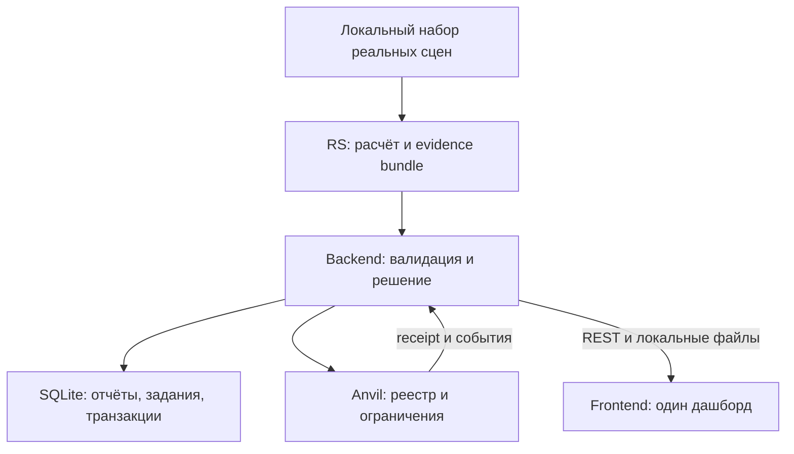
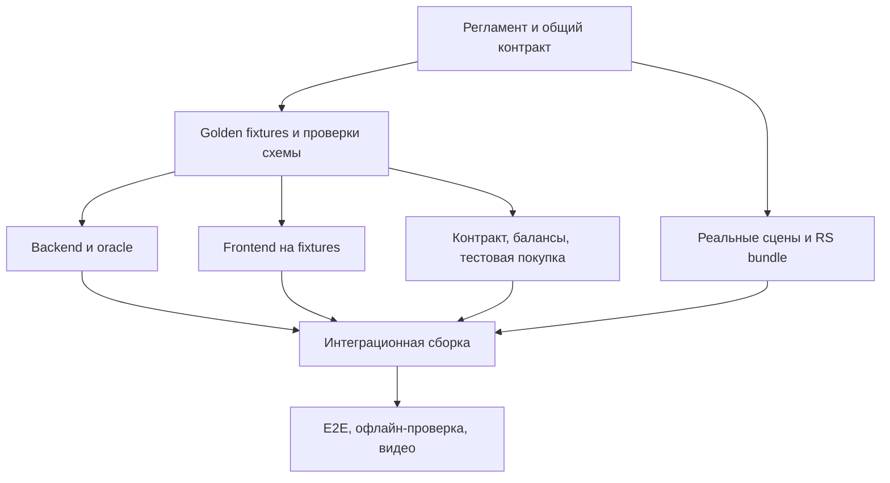
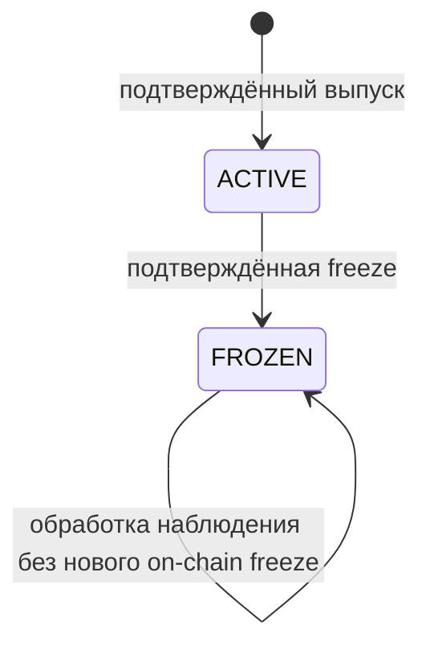

# BountyTeam — общий манифест команды

Версия: **1.0.1 · 16 сентября 2026**. Общие технические контракты: **1.0.0**. Кейс № 2: спутниковая верификация, токенизация и продажа углеродных единиц.

**Назначение:** обязательный общий контекст для пяти участников и их отдельных чатов с Claude. Документ фиксирует решения, границы и интерфейсы. Он заменяет противоречащие ему положения предыдущих планов.

**Статус документа:** общая спецификация к реализации, а не отчёт о готовом продукте. JSON Schema, OpenAPI, скомпилированный ABI абстрактной Solidity-спецификации и три синтетических golden fixtures созданы в общем пакете v1.0.0; 68 contract tests проходят. Это подтверждает согласованность пакета, но не существование готового backend/frontend, deployable смарт-контракта или реального RS-результата. Участок, реальные сцены, результаты измерений, адрес контракта и работоспособность приложения пока не подтверждены. Окончательные индивидуальные планы создаются после этого пакета.

## Как пользоваться

1. В общий чат отправляется этот файл целиком. Каждый прикладывает его к своему Claude перед индивидуальным заданием.
2. Все сначала читают разделы 1–8 и 14–18. Затем — интерфейсы своей роли в разделах 9–12.
3. Машинные контракты и одинаковые синтетические тестовые примеры находятся в общем пакете. Следующий шаг — окончательные индивидуальные планы.
4. Разработчик не меняет названия полей, статусы, API и ABI самостоятельно. Изменение проходит процедуру из раздела 14.
5. Манифест сам по себе не ограничивает нейросеть технически. Ограничения обеспечивают schema validation, тесты, review и решения тимлида.

### Короткий словарь

| Термин | Значение для нашей команды |
|---|---|
| MVP | Минимальный законченный продукт, доказывающий один пользовательский сценарий |
| P0 | Обязательно: без этого основной сценарий или честность результата нарушены |
| P1 | Усиление: делаем после работающего P0; при задержке убираем первым |
| P2 | Дополнительно: только после стабильной сборки и с разрешения тимлида |
| CUT | Не делаем на этом хакатоне; не расходуем время на реализацию |
| RS / ДЗЗ | Обработка данных дистанционного зондирования Земли |
| AOI | Полигон исследуемого участка, не весь спутниковый тайл |
| Oracle | Наш backend: проверяет доказательство, применяет правила и подписывает разрешённую транзакцию |
| Батч / batch | Серия тестовых единиц одного проекта; у серии общий статус, но балансы разных владельцев |
| Evidence | Отчёт наблюдения вместе с идентификаторами источников и контрольными суммами файлов |
| Fixture | Зафиксированный пример данных для одинаковых тестов всех модулей |
| E2E | Проверка всей цепочки через реальные границы модулей, а не отдельных функций |
| Receipt | Результат исполнения транзакции; отправка транзакции ещё не означает успех |
| DoD | Definition of Done: проверяемые условия, при которых работа считается законченной |
| Critical path | Последовательность зависимостей, без которой не состоится главный сценарий |

## 1. Цель продукта и границы MVP

**Продукт:** прототип платформы, на которой покупатель видит происхождение тестовой серии углеродных единиц, доступное спутниковое доказательство и ограничения её обращения. При обнаружении признаков пожара backend инициирует временную приостановку обращения связанной серии.

**Главная история:** реальный лесной участок → проверка до пожара → выпуск и тестовая покупка → новое реальное наблюдение после пожара → проверяемое доказательство → подтверждённая контрактом заморозка → отклонённая попытка передачи.

### Что фиксируем окончательно

- Один основной исторический пожар. Один запасной участок подбираем как страховку данных, а не как вторую обязательную демонстрацию.
- Три наблюдения: T0 и T1 до события, T2 после. T0 → T1 — отрицательный пример; T1 → T2 — пример повреждения. Сезонная сопоставимость важнее формального количества дат.
- RS выдаёт наблюдение, но не `FROZEN`. Решение о приостановке принимает backend-oracle по опубликованной политике.
- `FIRE_REVERSAL` — код риска возможной потери ранее учтённого углерода, а не измеренный объём выбросов и не обвинение владельца.
- `FROZEN` — временное техническое ограничение до проверки. Оно не означает юридического аннулирования кредита.
- Демонстрационные единицы не являются сертифицированными углеродными кредитами. Их количество не выводится из NDVI, площади или коэффициентов IPCC.
- Простая **покупка за локальную тестовую валюту входит в P0**: в формулировке кейса есть продажа. Полноценная биржа и реальные платежи не нужны.
- Frontend — один SPA-дашборд; весь доступ к данным и операциям идёт через backend.
- Локальная EVM-сеть Anvil — основная среда. Публичная тестовая сеть — необязательное дополнение.

### Чего мы не утверждаем

Не доказываем дополнительность, отсутствие утечки, точное поглощение CO₂, сертификацию, право собственности на участок или отсутствие двойного учёта во всех внешних реестрах. Не обещаем обнаружение всех пожаров и работу в реальном времени при облачности. Не приравниваем сохранность растительности к действительности кредита.

Хеш подтверждает соответствие сохранённым байтам, а не истинность наблюдения. Локальная сеть демонстрирует исполнение правил, но её оператор способен перезапустить или переписать тестовую историю. Это не публичная независимая инфраструктура доверия.

### Цель хакатона

За целевые **90 секунд основного демо** показать происхождение тестовой покупки и запрет дальнейшей передачи после подтверждённой заморозки. Это внутренняя цель тайминга, не уже измеренная скорость расчёта. Скачивание сцен не входит в эти 90 секунд; демонстрируется расчёт на локальных реальных данных либо явно обозначенный воспроизводимый replay.

Топ‑3 — цель, не обещание. Распределение 40 команд по кейсам, критерии и отдельные призовые места пока не подтверждены. Формула «3 / число команд» не является оценкой нашей вероятности победы.

## 2. Primary customer и бизнес-ценность

**Основной заказчик-гипотеза:** оператор площадки обращения лесных углеродных единиц. Покупатель и независимый верификатор — пользователи и участники процесса.

| Вопрос | Наш ответ |
|---|---|
| Боль | Между проверками оператору трудно быстро сопоставить новое повреждение леса с обращающимися сериями |
| Точка встраивания | Проверка проекта перед размещением и повторный мониторинг уже размещённых серий |
| Наше действие | Показать происхождение наблюдения, зарегистрировать сигнал, приостановить операции по согласованной политике, передать кейс человеку |
| Ценность | Меньше ручной сборки доказательств и меньше времени между получением пригодного наблюдения и ограничением в нашей системе |
| Что измеряем на демо | Время обработки локального набора, время от решения до receipt, успешность теста запрета передачи, воспроизводимость хеша |
| Что не выдумываем | Экономию в рублях, рыночную стоимость кредита, процент точности на популяции, сроки обнаружения без реального измерения |
| Возможная модель оплаты | Подписка/API за мониторинг проектов; гипотеза для интервью, не подтверждённая бизнес-модель |

Покупка в MVP — первичная продажа тестового остатка продавца по фиксированной цене. Нет заявлений о доходности, ликвидности или инвестиционной рекомендации. На экране явно написано: **«DEMO: тестовые единицы и тестовая валюта»**.

## 3. Архитектура и поток данных

### Зафиксированный стек

- RS: Python, rasterio/GDAL, numpy, pyproj, shapely; дополнительные библиотеки — только при необходимости.
- Backend: FastAPI, Pydantic v2, SQLite, web3.py; один постоянный worker для заданий и последовательная отправка транзакций каждого подписанта.
- Blockchain: Solidity, один реестр серий, Anvil; воспроизводимый deploy и тесты. Готовые компоненты контроля доступа допустимы с зафиксированными версиями.
- Frontend: React + TypeScript + Vite + Leaflet. Табы внутри одной страницы; минимальное число зависимостей.
- В репозитории фиксируются проверенные совместимые версии и lock-файлы. Команды с `@latest` и установка новых major-версий перед защитой запрещены.

### Кто с кем взаимодействует

| Граница | Передаём | Не передаём |
|---|---|---|
| RS → Backend | Проверяемый bundle: JSON, GeoJSON, превью, растр, контрольные суммы | Решение `FROZEN`, приватные ключи, произвольную команду контракту |
| Backend → Blockchain | Авторизованные вызовы, идентификатор серии, хеши, код причины | Снимки, полный отчёт, недоверенный вызов от браузера |
| Blockchain → Backend | Receipt, события, реальные балансы и статус | Предположение «транзакция, наверное, прошла» |
| Backend → Frontend | Единый REST API, URL локальных артефактов, отдельные состояния отчёта/серии/транзакции | Ключи, raw GeoTIFF для обязательной отрисовки, внутренние пути файлов |

Frontend не обращается напрямую к RS, RPC блокчейна, FIRMS или Copernicus. В P0 нет MetaMask: backend подписывает операции отдельными **демонстрационными** аккаунтами. Это явно обозначенная кастодиальная тестовая схема, а не децентрализованный кошелёк пользователя.

### Практически: как работа RS с его ноутбука попадает в продукт

1. В общем репозитории лежат код RS, схема запроса и маленькие fixtures. Большие исходные снимки — в локальном `data/`, вне Git; для них есть перечень файлов и SHA‑256.
2. Согласованный интерфейс запуска: `python -m rs.verify --request <request.json> --output <bundle_dir>`.
3. На ноутбуке RS этот запуск создаёт `verification.json` и файлы, перечисленные в `artifacts`. RS передаёт backend архив bundle и manifest исходных данных, а не скриншот результата.
4. Backend импортирует bundle через локальную служебную CLI-команду `python -m backend.tools.import_bundle --bundle <bundle_dir>`; она вызывает тот же валидатор, что рабочий worker. Публичный HTTP-upload в P0 не нужен.
5. На интеграционном ноутбуке worker запускает тот же RS-модуль на заранее доступных данных. Frontend запускает только зарегистрированный сценарий через API.
6. Файлы передаются через разрешённый командный канал/накопитель с проверкой контрольных сумм. Итоговый комплект хранится минимум на двух ноутбуках. Конкретный канал выбирает тимлид; пересылка «последнего JSON» в чате не заменяет версию в репозитории.

## 4. Critical path и dependency graph

Два независимых ранних риска: **наличие пригодных реальных данных** и **работающий обмен по согласованным интерфейсам**. Пока RS ищет данные, остальные работают на одинаковых синтетических fixtures. Их нельзя выдавать за реальные измерения.

| Владелец → потребитель | Вход → результат | Внутренний дедлайн | При задержке |
|---|---|---|---|
| Тимлид → все | Регламент и этот документ → зафиксированные решения | Пт 19:30 | Неясное требование помечается открытым; не подменяется догадкой |
| Backend + все потребители | Манифест → schema/OpenAPI и golden fixtures | Следующий подготовительный шаг, с учётом регламента | До фиксации никто не придумывает собственный enum |
| Blockchain → Backend | Согласованные сигнатуры → ABI, deployment manifest, адаптер и тесты | Пт 22:00 | Локальная сеть; публичную сеть отрезаем |
| RS → Backend + Frontend | Сцены → первый проверяемый bundle и выровненные превью | Пт 22:00 — целевой; Сб 11:00 — предельный для основной интеграции | Запасной участок; до готовности — маркированные fixtures |
| Backend → Frontend | Bundle + receipt → единый API и журнал | Пт 22:00 — каркас; Сб 02:00 — сквозной тест | Убираем P1/P2, не заменяем подтверждение мок-успехом |
| Все → Integration Owner | Реальные данные + рабочие модули → стабильный E2E | Сб 11:30 | Только восстановление P0, никаких новых фич |
| Integration Owner → Тимлид | Проверенная сборка → release, видео, инструкция | Сб 20:00 | Берём последний проверенный релиз; сдаём его |

Если три пригодные даты не находятся, тимлид может письменно согласовать замену отрицательного примера на **реальный неповреждённый контрольный AOI** при той же паре дат. Это изменение версии сценария, а не утверждение, что T0 существует. Такое сравнение не доказывает дополнительность.

## 5. P0 / P1 / P2 / CUT — приоритеты без двусмысленности

### P0 — без этого основная задача не выполнена

- Реальный участок и событие, идентификаторы исходных сцен, отрицательный и положительный примеры.
- Корректный RS-расчёт, маски качества, площадь по растру, отчёт и доказательство происхождения.
- Обработка недостаточных данных без ложного обвинения и автоматической заморозки.
- Валидация отчёта, воспроизводимый evidence hash, опубликованные decision rules.
- Выпуск ограниченной тестовой серии по явному demo-разрешению, реальные адресные балансы.
- Простая тестовая покупка, передача активных единиц, заморозка всей серии.
- Контракт отклоняет передачу и покупку замороженной серии, включая прямой RPC-вызов в тесте.
- Одна страница с участком, сравнением доступных изображений, серией, покупкой, статусами и журналом.
- Подтверждённое on-chain состояние отделено от ожидающего решения/транзакции.
- Офлайн-набор реальных данных, проверенный запуск, отрицательные тесты, сохранённое демо-видео.

### P1 — усиливает уже работающий P0

- SWIR-композит и dNBR-карта с аккуратной легендой; P0 может показывать простые выровненные превью и контур.
- Точки FIRMS на карте; в P0 их данные и связь с событием уже проверяются, но отдельный слой необязателен.
- Числовой Evidence Quality Score в UI и удобная страница проверки хеша. Сами проверки качества и целостности — P0.
- Более удобная карточка покупки, графики наблюдений, улучшенная демонстрация ошибок.
- Полностью автоматическая сборка одной командой. В P0 достаточно короткой инструкции, реально выполненной вторым человеком.

### P2 — только после стабильного P0 и решения тимлида

Контекстные контрольные участки, обзор повреждения вне границы проекта, второй проект, Sepolia, дополнительные графики. Ни буфер, ни соседний участок не называются автоматически leakage или synthetic control.

### CUT — исключено из реализации хакатона

Полный ERC‑3643; DAO; eDNA; акустические датчики; 30-дневная вероятность пожара; собственное обучение ML; точная биомасса/CO₂; дополнительность; выявление утечки как причинного эффекта; PostGIS; шесть отдельных экранов; KYC-платформа; реальная оплата; мультичейн; полноценная биржа; автоматическое юридическое аннулирование.

**Правило урезания:** сначала все P2, затем декоративные P1. Нельзя «урезать» реальные балансы, права, качество данных, честные статусы и доказательство запрета передачи. Новая идея не становится P0 только потому, что Claude уже написал для неё код.

## 6. Статусы, решения и state machine

Ни одна сущность не использует универсальное поле `status`, смысл которого зависит от автора. В API всегда ясно, чей это статус.

### 6.1. Наблюдение RS: `outcome`

| Значение | Значение для продукта |
|---|---|
| `NO_CHANGE` | Значимого изменения по выбранной методике в анализируемой области не обнаружено; не сертификат сохранности всего леса |
| `DISTURBANCE_DETECTED` | Обнаружен пространственно связный сигнал изменения; причина ещё требует сопоставления с дополнительными данными |
| `INSUFFICIENT_DATA` | Анализ не позволяет надёжно получить результат: недостаточно валидных данных или нарушены обязательные предпосылки |

`INSUFFICIENT_DATA` сохраняем явно: заставлять RS выбирать «есть пожар / нет пожара» при закрытом облаком участке нельзя.

### 6.2. Качество доказательства: `evidence_quality`

Backend выводит качество из измеримых полей RS, а не доверяет присланной красивой оценке.

| Значение | Правило политики v1 |
|---|---|
| `SUFFICIENT` | Доля парно валидных пикселей исходного леса ≥ 0.85; метаданные достаточны; сетки совпадают; сезонная сопоставимость подтверждена |
| `REVIEW_REQUIRED` | Доля ≥ 0.70, но < 0.85, либо сопоставимость сезонов `NO`/`UNCERTAIN`; автоматические финансовые действия не разрешены |
| `INSUFFICIENT` | Доля < 0.70 или не рассчитана; отсутствует необходимая исходная информация; нельзя корректно совместить сетки/применить масштабирование |

Проверка целостности/schema не пройдена — это ошибка приёма, а не качественный спутниковый отчёт. Пороги 0.70 и 0.85 — **наша demo policy**, не научный стандарт и не вероятность правильного ответа.

**EQS v1**, если показываем: `round(100 × paired_valid_forest_ratio)`. Это индикатор полноты пригодного покрытия, диапазон 0–100, не confidence модели. Он не заменяет остальные quality gates. При неизвестной доле показываем «нет оценки», а не 0% вероятности. Возраст исторического снимка относительно сегодняшнего дня EQS не уменьшает; исторический replay явно подписан.

### 6.3. Решение backend: `decision`

| Условия в порядке проверки | Решение | Последствие |
|---|---|---|
| Отчёт не прошёл schema, ссылки на проект, контрольные суммы | Отклонение запроса/задания | Нет выпуска и транзакций |
| Качество не `SUFFICIENT` | `REVIEW_REQUIRED` | Новые выпуски и покупки через наш API закрыты; автоматической заморозки нет |
| `NO_CHANGE`, качество достаточно, отчёт актуален для выбранного сценария | `NO_RESTRICTION` | Можно рассмотреть demo-выпуск/покупку; это не самостоятельное разрешение на выпуск |
| Есть изменение, но оно не достигло порога политики или не поддержано FIRMS | `REVIEW_REQUIRED` | Проверка человеком; не называем событие доказанным пожаром |
| Есть изменение, качество достаточно, достигнут порог площади и есть поддержка FIRMS | `FREEZE_REQUESTED`, причина `FIRE_REVERSAL` | Создаём намерение заморозить все активные серии проекта |

**Порог действия v1:** связные компоненты с dNBR ≥ 0.27 и площадью каждой ≥ 1 га; их суммарная площадь ≥ 5 га **и одновременно** ≥ 1% исходной площади леса внутри проекта. Эти числа — изменяемая только через review конфигурация прототипа, не оценка стоимости/объёма реверса.

Все проверки применяются к одной зафиксированной геометрии проекта. Соседний пожар без совпадения с повреждением внутри проекта не замораживает серию.

### 6.4. Состояние серии в контракте: `credit_status`

| Значение | Поведение |
|---|---|
| `ACTIVE` | Контракт допускает передачу и первичную тестовую покупку при остальных выполненных условиях |
| `FROZEN` | Контракт запрещает передачу и покупку всей серии у любого держателя; балансы сохраняются |
| `REVOKED` | Зарезервировано для последующего governance; автоматического перехода и функции отзыва в P0 нет |

Нет автоматического `FROZEN → ACTIVE` после хорошего снимка. Возврат обращения и отзыв требуют отдельной политики независимой проверки; в P0 не реализуются. Не выпущенный батч не имеет `ACTIVE`: отсутствующий идентификатор — ошибка.

`FROZEN → FROZEN` означает сохранение состояния серии при повторной обработке evidence или новом наблюдении, а не новый on-chain вызов `freeze`. Backend дедуплицирует evidence и повторные запросы. Новый evidence сохраняется отдельно, но не создаёт вторую freeze-транзакцию для уже `FROZEN` серии. On-chain `freeze` разрешён только для существующей `ACTIVE` серии; повторный вызов для `FROZEN` отклоняется без нового события `Frozen`. При timeout или pending Backend продолжает reconciliation существующей операции и не создаёт новую транзакцию с новым nonce. Frontend не приписывает новому evidence старый on-chain anchor. RS передаёт только наблюдение.

### 6.5. Технические состояния — отдельно

- Задание: `QUEUED → RUNNING → SUCCEEDED | FAILED`. После перезапуска незавершённый расчёт безопасно ставится заново либо завершается с явной ошибкой; успешность RS не равна успешности транзакции.
- Транзакция: `QUEUED → SUBMITTED → CONFIRMED | FAILED`. Таймаут receipt оставляет `SUBMITTED`, а не создаёт ложный `FAILED` или `FROZEN`.
- `CONFIRMED`: receipt имеет успешный статус, ожидаемое событие найдено, результат чтения контракта проверен. Для локального Anvil достаточно одного включённого блока; публичная сеть требует отдельной политики подтверждений.
- Пока freeze ожидает исполнения, UI пишет «Приостановка запрошена», а подтверждённый `credit_status` остаётся прежним. Backend закрывает новые операции через свой API; прямые передачи в контракте до исполнения freeze технически ещё возможны.
- Недостаточные данные не размораживают уже замороженную серию. Старое наблюдение не заменяет новое и не запускает новые финансовые действия. Смена даты просмотра в UI не откатывает историю контракта.

## 7. Владельцы, подстраховка и полномочия

| Роль | Главный результат | Право решения | Подстраховка |
|---|---|---|---|
| Тимлид | Согласованный продукт, приоритеты, приёмка, release, защита | Scope, изменения контрактов после согласования владельцев, выбор fallback | Backend знает порядок запуска/сдачи; Frontend знает сценарий показа |
| RS | Реальные источники, корректный анализ и bundle | Метод обработки в пределах согласованного интерфейса; ограничения данных | Backend умеет повторить документированный запуск; спорную методику за RS не выдумывает |
| Backend | API, хранение, policy, oracle и интеграционная сборка | Внутренняя реализация API без изменения контракта | Blockchain — адаптер и транзакции; тимлид — запуск/диагностика |
| Blockchain | Балансы, права, продажа, ограничения, тесты | Внутренняя реализация при согласованном ABI | Backend умеет redeploy и прогон тестов по инструкции |
| Frontend | Один понятный дашборд и демонстрация | Компоновка и визуальные детали без изменения смысла данных | Тимлид умеет запустить сборку и видео |

**Integration Owner:** Backend. Он отвечает за техническую совместимость и E2E-сборку, а не за самостоятельное исправление всей команды. **Accountable за интеграцию:** тимлид — ставит сроки, убирает блокеры, принимает результат.

**Demo Operator:** Frontend; запасной — тимлид. Основной спикер — тимлид. Ноутбук во время защиты не передаём по кругу.

Тимлид может исправить конфиг, воспроизвести баг, сделать review/merge или небольшой glue-script. Он не начинает отдельную большую ветку разработки в ущерб интеграции.

## 8. Правила научной и продуктовой честности

Каждое существенное утверждение в документах и защите получает один класс:

| Класс | Пример |
|---|---|
| `FACT` | Конкретный снимок имеет указанный scene ID; прямой тест передачи завершился revert; источник описывает выбранный метод |
| `ASSUMPTION` | Оператор площадки — предполагаемый покупатель нашего сервиса |
| `DEMO_LOGIC` | В этом прототипе повреждение ≥ 5 га и ≥ 1% при выполнении остальных условий вызывает временную блокировку |
| `ROADMAP` | Подтверждение независимым верификатором и интеграция с внешним реестром ещё не реализованы |

В интерфейсе и питче нельзя выдавать `DEMO_LOGIC` за обязательное правило углеродного рынка, а `ROADMAP` — за готовую функцию.

Готовая формулировка позиционирования: **«Мы показываем, как воспроизводимое спутниковое наблюдение может запускать временное ограничение обращения тестовой серии по прозрачной политике оператора. Мы не заменяем сертификацию, расчёт углерода и независимую проверку».**

Список проверенных источников и исключённых утверждений — в приложении A. Новые проценты, показатели точности и «исследования показали» без первоисточника в презентацию не попадают.

## 9. Единый REST API — нормативный дизайн v1

Базовый путь: `/api/v1`. Browser использует относительные пути; dev proxy и production-раздача настраиваются один раз. Источник истины формы HTTP — `/contracts/openapi.yaml`; сгенерированный FastAPI `/openapi.json` проверяется на соответствие ему. Не поддерживаем две независимо редактируемые спецификации.

### 9.1. Общие правила

- Все timestamps: UTC, формат `YYYY-MM-DDTHH:mm:ssZ`. Временные интервалы сравнения задаются по времени съёмки, а не загрузки файла.
- `plot_id` — строка. `job_id`, `verification_id`, `operation_id` — UUID-строки. `batch_id`, количества единиц и значения wei — **десятичные строки**: JavaScript не должен терять точность `uint256`.
- Количество единиц — целое положительное, без десятичных долей. Цена выражается в минимальных единицах локальной тестовой валюты, не в рублях/долларах.
- Все mutating-запросы требуют авторизации и `Idempotency-Key`. Ошибка HTTP должна проверяться клиентом через `response.ok`.
- Для локального демо: `X-Demo-Session` разрешает демонстрационную сессию; `X-Demo-Actor: issuer|buyer|recipient` выбирает только заранее разрешённый тестовый аккаунт. Сервер проверяет права роли. Это не production-аутентификация и не личность настоящего инвестора.
- API слушает loopback по умолчанию. При доступе других ноутбуков адрес, CORS и права настраиваются явно; нельзя одновременно публиковать endpoint в интернет и полагаться на demo-заголовки.
- Нет публичной ручки `/freeze`. Заморозку вызывает внутренний oracle. Ключи администратора и кошельков никогда не отправляются в frontend.
- Ответы чтения — объекты по схеме; списки — `{ "items": [...] }`. Пустой список отличается от ошибки.
- Формат ошибки: `{ "error": { "code": "...", "message": "...", "details": {} }, "request_id": "..." }`. Стектрейс и секреты клиенту не возвращаются.

### 9.2. Эндпоинты P0

| Метод и путь | Вход / назначение | Результат |
|---|---|---|
| `GET /health` | Состояние сервиса и зависимостей | `api`, `db`, `worker`, `chain`, `deployment_id`, `mode`; недоступная сеть не маскируется общим `ok` |
| `GET /plots` | Список зарегистрированных проектов | `items` с `plot_id`, названием и краткой сводкой |
| `GET /plots/{plot_id}` | Проект | Геометрия, её хеш, площадь, актуальная проверка, решения и признаки доступности действий |
| `POST /plots/{plot_id}/verify` | Например, `{ "scenario_id": "baseline" }`; разрешены baseline, post_fire, insufficient; только issuer | `202`: `job_id`, `state: QUEUED`, `status_url` |
| `GET /jobs/{job_id}` | Polling задания | `state`, `verification_id` или `null`, `error` или `null`; никакого ожидания завершения внутри HTTP |
| `GET /verifications/{verification_id}` | Отчёт и решение | `evidence`, `evidence_hash`, `evidence_quality`, `decision`, `reason`, `is_latest`, `processed_at`, ссылки на артефакты |
| `GET /verifications/{verification_id}/proof` | Проверка целостности и якорей | `evidence_hash`, `recomputed_hash`, `decision_hash`, `canonical_url`, `anchors`, `integrity_ok` |
| `GET /verifications/{verification_id}/canonical` | Точные канонические байты | JSON, который действительно хешировался; не новая pretty-printed версия |
| `GET /plots/{plot_id}/history` | История наблюдений | Упорядоченный список проверок со временем съёмки и обработки |
| `GET /plots/{plot_id}/credits` | Серии проекта | Батчи, подтверждённые статусы, остатки продавца и баланс выбранного demo-актора |
| `POST /plots/{plot_id}/issue` | `{ "demo_authorization_id": "..." }`, только issuer | `202`: `operation_id`, `transaction_state`, `status_url`; параметры берутся из разрешения, а не из NDVI |
| `POST /batches/{batch_id}/buy` | `{ "amount": "10" }`, buyer/recipient | `202` с операцией; покупатель оплачивает установленную контрактом цену тестовой валютой |
| `POST /batches/{batch_id}/transfer` | `{ "to_actor": "recipient", "amount": "1" }` | `202` с операцией; отправитель — выбранный авторизованный demo-актор |
| `GET /operations/{operation_id}` | Polling финансовой операции | Состояние, `tx_hash`, `batch_id` при наличии, ошибка, receipt-summary |
| `GET /events?plot_id=...` | Единый журнал | Наблюдения, решения, отправки и подтверждения транзакций; пагинация курсором |
| `GET /artifacts/{artifact_id}` | Разрешённый сохранённый артефакт | PNG/WebP/GeoJSON/GeoTIFF с правильным MIME; не произвольный путь с диска |

Регистрация одного проекта в P0 выполняется seed-командой, а не отдельным UI редактора. `POST /plots` — P1, если потребуется кейсодержателю. Произвольные URL, shell-команды и пути к снимкам публичный API не принимает.

`scenario_id` — ключ серверного manifest сценариев, а не текстовая команда «покажи красный статус». `baseline` соответствует реальному T0 → T1; `post_fire` — T1 → T2. `insufficient` используется для явно маркированного теста качества либо реального облачного примера.

### 9.3. Что возвращаем на ошибки

| Код | Когда |
|---|---|
| `401 / 403` | Нет demo-сессии или недостаточно прав |
| `404` | Не существует проекта, отчёта, батча, операции или артефакта |
| `409` | Тот же idempotency key с другим телом; действие запрещено текущим состоянием; deployment не совпадает |
| `422` | Неверная схема, диапазоны, геометрия, несогласованные поля/контрольные суммы |
| `503` | Нельзя надёжно принять операцию, например не работает БД; уже сохранённое намерение не теряем |

Если запрос надёжно сохранён, но сеть блокчейна временно недоступна, возвращаем операцию `QUEUED` с диагностикой. Не возвращаем ложный успех операции и не просим пользователя вслепую создавать новую.

### 9.4. Долгие задачи, повторы и восстановление

1. `/verify` сначала сохраняет задание, затем сразу отвечает `202`. RS-обработка работает в отдельном процессе/worker, не блокирует async event loop.
2. Для MVP достаточно SQLite и одного worker. FastAPI `BackgroundTasks` само по себе не является надёжной очередью с восстановлением после аварии; не обещаем такую гарантию без собственного сохранения состояния. [Документация FastAPI](https://fastapi.tiangolo.com/tutorial/background-tasks/).
3. Уникальный ключ запроса: актор + тип операции + `Idempotency-Key`; хранится хеш нормализованного тела. Повтор с тем же телом возвращает ту же операцию. Другое тело — `409`.
4. Принятый evidence дедуплицируется по проекту, версии геометрии и `evidence_hash`. Один отчёт не создаёт второй выпуск или повторное действие по уже замороженной серии.
5. До отправки транзакции сохраняется намерение. Отправки одного подписанта сериализуются; nonce берётся с учётом pending. Подписанная транзакция и её вычисляемый tx hash сохраняются до broadcast с ограниченным доступом.
6. При таймауте сначала ищем receipt/tx и читаем контракт. Повторно отправляем те же подписанные байты, если уместно; не подписываем «дубль» с новым nonce без reconciliation.
7. После рестарта worker восстанавливает очередь и проверяет отправленные операции. Завершённое on-chain действие не исполняется повторно из-за отставшей SQLite. Неисправимый отказ до broadcast переводит QUEUED в FAILED с причиной; временная недоступность сети оставляет QUEUED.
8. Смена локального deployment обнаруживается по `deployment_id`, адресу, chain ID и code hash. Даже если Anvil снова имеет тот же chain ID, нельзя использовать старые батчи из БД. Reset демо — явная процедура на отдельном demo-наборе, без молчаливого удаления данных.

## 10. JSON-контракт, хеширование и golden fixtures

### 10.1. Единственная схема RS

Следующий шаг создаёт `/contracts/verification.schema.json`: JSON Schema Draft 2020-12, версия `1.0.0`, `additionalProperties: false` у контрактных объектов. Pydantic и TypeScript должны соответствовать ей. Строковые enum не переводятся на русский внутри данных.

Основной объект называется `VerificationEvidence`. В нём **нет** `FROZEN`, `REVOKED`, `confidence`, приватного ключа и `evidence_hash`.

| Поле | Тип и обязательность | Смысл |
|---|---|---|
| `schema_version` | string, обязательно, `1.0.0` | Версия формата |
| `dataset_kind` | `REAL` или `SYNTHETIC`, обязательно | Происхождение значений; fixture не превращается в реальные данные при импорте |
| `plot_id` | string, обязательно | Зарегистрированный проект |
| `plot_geometry_hash` | hash32, обязательно | Привязка к точным утверждённым координатам |
| `observation` | object, обязательно | `before`, `after`: описания сцен; порядок дат строго возрастающий |
| `outcome` | enum из раздела 6.1, обязательно | Наблюдение RS |
| `method` | object, обязательно | Версия пайплайна, git commit, параметры, сетка, маска исходного леса |
| `quality` | object, обязательно | Покрытие валидными пикселями и явные quality gates |
| `metrics` | object, обязательно | Измеренные индексы и площади с указанными знаменателями |
| `firms` | object, обязательно | Поддержка пожарной интерпретации и происхождение сопоставления |
| `artifacts` | array, обязательно | Manifest выходных файлов и их контрольных сумм |
| `limitations` | array[string], обязательно, можно `[]` | Конкретные ограничения данного расчёта |

`hash32` в JSON — строка `0x` + ровно 64 строчных hex-символа. Контракт получает соответствующие 32 байта, не строку и не хеш от строки.

### 10.2. Вложенные поля, которые обязаны совпасть у RS и backend

| Объект | Поля и единицы |
|---|---|
| `observation.before/after` | `scene_id`, `acquired_at`, `provider`, `collection`, `processing_baseline`, `mgrs_tile`, `assets` |
| Каждый входной `assets[]` | `band`, `source_ref` без секретов, `local_sha256`, `scale_applied`, `offset_applied`, `transform_origin` со значением `PRODUCT_METADATA` или `PROVIDER_HARMONIZED`; хешируется именно использованный локальный файл/окно |
| `method` | `pipeline_version`, `code_commit`, `config_sha256`, `grid`, `forest_mask`, `parameters` |
| `method.grid` | `epsg` integer, `resolution_m: 20`, `width`, `height`, `transform` из 6 коэффициентов в порядке rasterio/Affine |
| `method.forest_mask` | `source`, `version`, `reference_year`, `sha256`, `interpretation_note`; исходная маска одна для пары дат |
| `method.parameters` | `ndvi_bands: [B08,B04]`, `nbr_bands: [B8A,B12]`, `disturbance_dnbr_min: 0.27`, `min_component_area_ha: 1`, `connectivity: 8`, `excluded_scl_classes`, `resampling_continuous`, `resampling_categorical` |
| `quality` | `paired_valid_aoi_ratio`, `paired_valid_forest_ratio`, `aoi_cloud_ratio_before`, `aoi_cloud_ratio_after` — числа 0–1 либо `null`; `metadata_complete`, `grid_aligned` — boolean; `temporal_comparability` — `YES`, `NO` или `UNCERTAIN`; `temporal_note` |
| `metrics` | `plot_area_ha`, `baseline_forest_area_ha`, `analysed_forest_area_ha`, `affected_area_ha`, `affected_fraction_of_baseline_forest`, `ndvi_before_mean`, `ndvi_after_mean`, `dnbr_mean`, `dnbr_mean_scope: PAIRED_VALID_BASELINE_FOREST`; целые `baseline_forest_pixel_count`, `paired_valid_forest_pixel_count`, `affected_pixel_count` |
| `firms` | `support` — `SUPPORTED`, `NOT_FOUND` или `NOT_CHECKED`; `hotspot_count`, `window_start`, `window_end`, `spatial_tolerance_m`, `product`, `confidence_filter`, `source_refs`, `matched_points_artifact_id` или `null` |
| Каждый `artifacts[]` | `artifact_id`, `role`, `relative_path`, `media_type`, `sha256`, `size_bytes`; у превью дополнительно `bounds_wgs84` и размеры изображения |

Правила nullable:

- Если исходные данные не удалось получить, идентификаторы **запрошенных** сцен могут оставаться в записи, но неизвестные baseline/assets явно отсутствуют через разрешённый `null`/пустой массив в ветке `INSUFFICIENT_DATA`. Их нельзя выдумывать ради прохождения схемы.
- `plot_area_ha` > 0 всегда берётся из зарегистрированного проекта/зафиксированной растровой геометрии. Остальные измерения разрешают `null`, когда их нельзя вычислить; `0` означает измеренный нулевой результат.
- Для `SUFFICIENT` все обязательные источники, числовые метрики и входные хеши должны быть заполнены; исходная площадь леса > 0. Backend проверяет это как cross-field validation.
- Backend пересчитывает quality gates и проверяет согласованность outcome с метриками. `INSUFFICIENT_DATA` при полностью достаточных и непротиворечивых данных либо `NO_CHANGE` при найденных компонентах не принимаются молча: нужны исправленный отчёт или явно зафиксированное дополнительное ограничение метода.
- `NO_CHANGE`/`DISTURBANCE_DETECTED` требуют вычислимых индексов. `INSUFFICIENT_DATA` не обязан содержать карту dNBR.
- Все числа конечны. `NaN`, `Infinity`, строки вместо чисел и бессмысленные отрицательные площади запрещены. Для индексов не выполняется молчаливый clip, скрывающий ошибки reflectance; допустимость входов и знаменателя проверяется в RS.

Эти структурные условия оформлены в `/contracts/verification.schema.json`; дополнительные межполевые правила проверяет reference validator и должен реализовать backend. Произвольный JSON считается совместимым только после обеих проверок.

### 10.3. Определения метрик

- `baseline_forest_area_ha`: площадь исходной маски древесного покрова внутри AOI. Это не юридически установленная площадь лесного фонда.
- `analysed_forest_area_ha`: её часть с валидными пикселями на **обеих** датах.
- `paired_valid_forest_ratio = analysed_forest_area_ha / baseline_forest_area_ha`.
- Целые pixel counts — источник для расчёта лесных площадей и пороговых долей. Backend проверяет `affected_pixel_count ≤ paired_valid_forest_pixel_count ≤ baseline_forest_pixel_count` и согласованность площадей с grid. Пограничные решения не зависят от округлённых UI-чисел.
- `affected_area_ha`: площадь оставшихся после фильтра минимальной площади компонентов с dNBR ≥ 0.27 на парно валидной исходной лесной маске.
- `affected_fraction_of_baseline_forest = affected_area_ha / baseline_forest_area_ha`. Не подменяем знаменатель площадью только ясных пикселей.
- Средние NDVI и dNBR считаются по одной и той же парно валидной исходной лесной области, не по всему bbox и не только по повреждению.
- `outcome = DISTURBANCE_DETECTED`, если при пригодности для расчёта остался хотя бы один компонент ≥ 1 га; backend отдельно применяет пороги финансового действия из раздела 6.3. На недостаточных данных — `INSUFFICIENT_DATA`.
- `aoi_cloud_ratio_*` считает классы облаков 8/9/10 внутри AOI; тени, снег, no-data и остальные исключения дополнительно уменьшают valid ratios. Поэтому `1 - cloud_ratio` не равно автоматически valid ratio.

### 10.4. Кто считает хеш и что именно хешируется

**Backend — единственный владелец вычисления `evidence_hash`.** RS считает контрольные суммы своих входных/выходных файлов, которые backend проверяет перед приёмом.

Порядок:

1. Проверить schema и связь с геометрией проекта; проверить файлы по manifest. Запретить абсолютные/выходящие через `..` пути, внешние неожиданные URL и символические ссылки за пределы bundle.
2. Проверить нормализацию: UTC с `Z`, конечные числа, согласованные единицы. До экспорта RS округляет отчётные средние индексов/доли/площади до 6 десятичных знаков; backend валидирует это. Конфигурационные коэффициенты и геотрансформация сохраняют согласованную необходимую точность. RS классифицирует пиксели до округления, а backend вычисляет area/coverage-пороги по целым pixel counts; граничные случаи тестируются отдельно.
3. Упорядочить manifest-массивы по стабильным ключам; до/после не переставлять; координаты геометрии не менять после утверждения. Не добавлять случайный job ID или временный URL в evidence.
4. Получить байты **JCS по RFC 8785**, затем `SHA-256`. Python `sort_keys=True` без дополнительных правил не считается полной реализацией JCS. [RFC 8785](https://www.rfc-editor.org/rfc/rfc8785).
5. Сохранить исходный принятый evidence, канонические байты и хеш неизменяемой записью. `processed_at`, `job_id`, время приёма, URL раздачи и статус транзакции находятся во внешней оболочке, не в evidence.
6. Отдельно создать `decision_record`: `evidence_hash`, `plot_id`, `policy_version`, `policy_parameters_hash`, `decision`, `reason`, `effective_observed_at`, `replay_as_of`. Его JCS SHA‑256 — `decision_hash`.
7. В контракт передать готовые байты хешей без `keccak(text=evidence_hash)` и без повторного SHA‑256. Freeze якорит и доказательство, и принятое по нему решение.

Хеш отчёта включает manifest хешей результатов: изменение растра/GeoJSON должно обнаруживаться даже при неизменном `verification.json`. URL скачивания не является доказательством сохранности файла.

`plot_geometry_hash = SHA-256(JCS(approved_geometry))`, где `approved_geometry` — сохранённый GeoJSON Geometry без изменяемых свойств и UI-подписей. RS получает именно эту геометрию и хеш в запросе. Порядок колец, вершин и координаты после утверждения не переупорядочиваются произвольно. Это идентификатор версии границы, а не доказательство прав на землю.

Проверка `/proof` различает: «байты совпадают», «хеш записан в конкретной подтверждённой транзакции» и «отчёт пока не имеет on-chain якоря». Не каждое наблюдение обязано порождать транзакцию. Хороший новый отчёт не обязан совпадать с хешем предыдущей freeze.

### 10.5. Golden fixtures и реальные демонстрационные данные

| Будущий файл | Назначение | Ожидаемый результат |
|---|---|---|
| `/fixtures/verification_no_change.json` | Синтетический контрактный тест: достаточные данные, нет значимого изменения | `NO_CHANGE` → `SUFFICIENT` → `NO_RESTRICTION` |
| `/fixtures/verification_fire.json` | Синтетический контрактный тест: изменение выше policy-порогов, FIRMS support | `DISTURBANCE_DETECTED` → `SUFFICIENT` → `FREEZE_REQUESTED` |
| `/fixtures/verification_insufficient.json` | Синтетический контрактный тест нехватки наблюдений | `INSUFFICIENT_DATA` → `INSUFFICIENT` → `REVIEW_REQUIRED`, без freeze |
| `/data/demo/real_baseline/` | Сохранённый реальный расчёт T0 → T1 | Реальные источники и результаты; ожидаемый исход подтверждает RS |
| `/data/demo/real_post_fire/` | Сохранённый реальный расчёт T1 → T2 | Реальные источники и результаты; не подгоняется под fixture |

Golden fixtures находятся в `/fixtures`: у них явно тестовые идентификаторы, реальные проверяемые файлы и контрольные суммы; плейсхолдеров `0x...` нет. Они допускаются в изолированном тестовом режиме и никогда не маркируются `REAL`.

Режимы отображаются раздельно:

- `dataset_kind`: `REAL` / `SYNTHETIC` — откуда значения.
- Режим наблюдения: `HISTORICAL_REPLAY` — демонстрируем прошлое событие; не называем его текущим.
- Режим вычисления: `COMPUTED` / `CACHED_REPLAY` — выполнен расчёт сейчас или воспроизведён сохранённый результат.

`COMPUTED` на локальных реальных растрах не требует интернета. `CACHED_REPLAY` допустим как честный fallback; доказывает интеграцию, но не новый запуск анализа.

## 11. Backend ↔ Blockchain: минимальный интерфейс

### 11.1. Модель и доверие

Один `CarbonCreditRegistry`, одна серия на один demo-authorization, P0 демонстрирует один проект. Это пользовательский реестр серий, **не заявленная реализация ERC‑20/1155/3643**.

- Owner управляет разрешёнными issuer/oracle. Нельзя самостоятельно назначить себя агентом.
- При deploy `constructor(address initialOwner)` получает явно указанный ненулевой адрес владельца; issuer/oracle разрешаются только владельцем. Не используем контракт с неинициализированными правами.
- Issuer выпускает только разрешённые тестовые серии.
- Oracle инициирует freeze после backend-policy. Контракт доверяет авторизованному oracle; он не умеет читать спутниковые снимки и сам не проверяет NDVI.
- Держатель передаёт только свой баланс. Backend подписывает от соответствующего demo-аккаунта, а не подменяет владельца параметром запроса.
- `totalSupply` не уменьшается при передаче: списание у отправителя равно зачислению получателю.
- Заморозка хранится на уровне серии, поэтому распространяется на всех её держателей после покупки/передачи.

### 11.2. Сигнатуры, которые закрепляем до реализации

`/contracts/contract-abi.json` сгенерирован `solc 0.8.30` из `/contracts/contract-interface.sol` и проверяется по хешу. Это ABI **абстрактной спецификации интерфейса**, а не реализованного контракта: deployable bytecode и адрес отсутствуют. Blockchain-разработчик реализует контракт в рамках этого интерфейса; адрес появляется только после настоящего deploy.

| Сигнатура | Доступ и обязательные проверки |
|---|---|
| `setIssuer(address account, bool allowed)` | Только owner; ненулевой адрес |
| `setOracle(address account, bool allowed)` | Только owner; ненулевой адрес |
| `issue(bytes32 issuanceKey, string plotId, address seller, uint256 amount, uint256 unitPriceWei, bytes32 evidenceHash, uint64 observedAt) returns (uint256 batchId)` | Только issuer; новый issuanceKey; непустой проект; seller не zero; amount и цена > 0; ненулевой хеш; создать серию и баланс продавца |
| `buy(uint256 batchId, uint256 amount) payable` | Существующая ACTIVE-серия; amount > 0; покупатель не seller; есть остаток; `msg.value == amount × unitPriceWei`; настоящие балансы и учёт выручки |
| `transfer(uint256 batchId, address to, uint256 amount)` | Существующая ACTIVE-серия; amount > 0; to не zero; баланс `msg.sender` достаточен |
| `freeze(uint256 batchId, bytes32 evidenceHash, bytes32 decisionHash, uint64 observedAt, uint8 reasonCode)` | Только oracle; серия существует и ACTIVE; хеши не zero; наблюдение не старее записанного; reasonCode = 1 для FIRE_REVERSAL |
| `balanceOf(uint256 batchId, address account) view returns (uint256)` | Баланс данного держателя в конкретной существующей серии |
| `getBatch(uint256 batchId) view returns (BatchView)` | Неизвестная серия — ошибка, не enum по умолчанию |
| `withdrawProceeds()` | Вывод только накопленной выручки `msg.sender`; checks-effects-interactions и защита от reentrancy |

`BatchView`: `plotId`, `issuanceKey`, `seller`, `totalSupply`, `creditStatus`, `unitPriceWei`, `evidenceHash`, `decisionHash`, `issuedAt`, `frozenAt`, `lastObservedAt`. `creditStatus`: 0 = ACTIVE, 1 = FROZEN, 2 = REVOKED (зарезервировано). `decisionHash` после issue может быть zero, до первой freeze; `frozenAt` — 0. Backend переводит enum в строку, frontend не трактует числа самостоятельно.

Передача самому себе в v1 отклоняется как `InvalidAddress`; это фиксируется в тестах. Никакие `revoke`/`unfreeze` не появляются в P0 без отдельного решения по governance.

### 11.3. Продажа без большого маркетплейса

В seed-конфиге есть demo-разрешение: например, 100 неделимых тестовых единиц по фиксированной цене в локальной валюте. Это демонстрационные параметры, **не результат измерения углерода**. Backend проверяет разрешение и положительный результат baseline; контракт гарантирует однократность `issuanceKey`.

`issuanceKey = SHA-256(JCS({ plot_id, demo_authorization_id, deployment_id }))`. Выданное разрешение нельзя повторно использовать для нового количества. Число и цена сверяются с серверной конфигурацией; клиент не присылает произвольный лимит выпуска.

После покупки токены реально переходят от seller к buyer. Выручка накапливается к выводу seller; `buy` не выполняет внешний перевод продавцу в середине смены балансов. Freeze не уничтожает балансы и не является возвратом оплаты; вывод уже полученной выручки не изображается как отозванный платёж.

### 11.4. События и интеграционный handoff

Минимальные события:

- `Issued(batchId, issuanceKey, seller, amount, evidenceHash)`.
- `Purchased(batchId, buyer, amount, paidWei)`.
- `Transferred(batchId, from, to, amount)`.
- `Frozen(batchId, evidenceHash, decisionHash, observedAt, reasonCode)`.
- `ProceedsWithdrawn(seller, amountWei)`; события изменения разрешений issuer/oracle.

Точные Solidity-типы и indexed-поля зафиксированы в `contract-interface.sol` и скомпилированном ABI. Backend не извлекает `batch_id` догадкой из счётчика: использует подтверждённое `Issued` и проверку чтением.

Blockchain передаёт backend:

1. `/contracts/contract-abi.json`, сгенерированный из компиляции.
2. Локальный deployment manifest: `deployment_id`, `chain_id`, `contract_address`, `deployment_tx_hash`, `contract_code_hash`, `abi_sha256` и публичные адреса ролей — **без приватных ключей**.
3. Версионированный Python-адаптер с методами `issue`, `buy`, `transfer`, `freeze`, чтением receipt/батчей/балансов. Его интерфейс и реализацию совместно принимают Backend и Blockchain.
4. Команду deploy, тесты, ошибки контракта и инструкцию восстановления.

Единственный runtime-владелец отправки oracle-транзакций — backend worker. Blockchain-разработчик не запускает второй независимый `oracle.py`, который параллельно расходует тот же nonce.

Минимальные contract errors: `Unauthorized`, `UnknownBatch`, `DuplicateIssuance`, `InvalidAmount`, `InvalidAddress`, `InsufficientBalance`, `BatchNotActive`, `IncorrectPayment`, `StaleObservation`. Они документируются и переводятся backend в понятные сообщения; revert не скрывается toast-успехом.

## 12. Геоданные, RS-метод и визуализация

### 12.1. Выбор участка и источников

До фиксации реальных scene IDs нет «готовой научной демонстрации». Выбираем достаточно крупный, визуально различимый исторический пожар с пригодными наблюдениями; административная принадлежность Красноярскому краю желательна только если помогает кейсу, но не важнее качества данных.

Основной источник — Sentinel‑2 L2A через CDSE. Поиск в каталоге и фактическое скачивание — две разные проверки: нужно реально прочитать нужный канал с корректной авторизацией. STAC и S3 описаны в [документации CDSE STAC](https://documentation.dataspace.copernicus.eu/APIs/STAC.html) и [CDSE S3](https://documentation.dataspace.copernicus.eu/APIs/S3.html). Утверждение «STAC в 2026 не работает» не используем без конкретного воспроизводимого сбоя.

Резерв — заранее сохранённые реальные файлы с метаданными либо другой проверенный провайдер. При смене провайдера заново проверяются scale/offset и формат, а не только доступность URL. В P0 не создаём несколько полноценных загрузчиков.

Исходная маска — например, слой древесного покрова ESA WorldCover 2021, если он предшествует выбранному событию и подходит AOI. Это 10-метровый land-cover продукт, а не актуальная инвентаризация конкретного проекта: фиксируем год, источник и ограничения, визуально проверяем на снимке до события. [ESA WorldCover](https://esa-worldcover.org/en).

### 12.2. Обработка, которую нельзя пропустить

1. Выбрать сопоставимые сезонные условия и задокументировать даты события. «Всегда брать разницу ровно год» и «любые два ясных снимка» не являются универсальным правилом. Снег, дым, низкое солнце и фенология могут делать пару непригодной.
2. Привести цифровые значения к reflectance по метаданным продукта: `(DN + BOA_ADD_OFFSET_i) / QUANTIFICATION_VALUE`. Для PB ≥ 04.00 предусмотрен offset; нулевой DN может означать no-data. Нельзя просто вычитать 1000 из любого файла: провайдер мог уже выполнить гармонизацию. Записать реально применённые преобразования для каждого канала. [Copernicus: S2 Products](https://sentiwiki.copernicus.eu/web/s2-products), [Sentinel Hub L2A и harmonizeValues](https://documentation.dataspace.copernicus.eu/APIs/SentinelHub/Data/S2L2A.html).
3. Зафиксировать общую метрическую сетку 20 м: CRS, transform, extent, dimensions. Одна MGRS-плитка упрощает задачу, но не отменяет проверки совмещения. Непрерывные 10-метровые каналы агрегировать на 20 м; категориальные маски — nearest neighbor.
4. NDVI = `(B08 − B04) / (B08 + B04)`; NBR = `(B8A − B12) / (B8A + B12)`; dNBR = `NBR_before − NBR_after`. Знаменатель и no-data проверять до деления. Применение B8A/B12 на 20 м и классификация ниже опираются на [EFFIS Fire Severity](https://forest-fire.emergency.copernicus.eu/about-effis/technical-background/fire-severity).
5. Для автоматического решения консервативно исключать SCL 0, 1, 2, 3, 7, 8, 9, 10, 11; воду 6 исключать из анализа леса. Постпожарный класс 5 не вырезать только потому, что он не растительность. Обработку классов и её ограничения фиксировать.
6. SCL 2 нельзя безоговорочно считать хорошими тёмными пикселями: значение/название класса менялось, актуальная документация указывает cast shadow. Если тени исключили предполагаемую гарь, результат отправляем на review/берём другую дату; не сохраняем тени автоматически ради красивой площади. Маски проверяются глазами и количественно. [Copernicus: S2 Processing](https://sentiwiki.copernicus.eu/web/s2-processing).
7. Рассчитать парно валидное покрытие внутри AOI и исходного леса. Не использовать облачность всей плитки как качество конкретного участка. Маска исходного леса не пересчитывается по снимку после пожара так, чтобы повреждение исчезло из знаменателя.
8. Выделить компоненты по порогу, удалить компоненты < 1 га с connectivity 8. Не заполнять облачные/no-data области как повреждённые. Любая дополнительная морфология должна быть описана и включена в config hash.
9. Площадь считать по исходной бинарной маске в метрической проекции: `число пикселей × abs(det(pixel_transform)) / 10000`. При квадратных 20-метровых пикселях это 0.04 га на пиксель. Отображаемый упрощённый GeoJSON не используется для пересчёта площади.
10. Для GeoJSON преобразовать координаты в WGS84, порядок `[longitude, latitude]`; валидировать полигоны. Порядок `[latitude, longitude]` у части методов Leaflet — ответственность UI-адаптера. [GeoJSON RFC 7946](https://www.rfc-editor.org/rfc/rfc7946).

### 12.3. Шкала dNBR — единая во всех местах

| dNBR | Подпись легенды |
|---|---|
| `< 0.10` | Низкий/отсутствующий сигнал повреждения или восстановление; не доказательство отсутствия пожара |
| `0.10 ≤ x < 0.27` | Low |
| `0.27 ≤ x < 0.44` | Moderate-low |
| `0.44 ≤ x < 0.66` | Moderate-high |
| `x ≥ 0.66` | High |

Это заимствованная шкала для спектрального изменения, не универсальная калибровка потери биомассы в Сибири. EFFIS описывает вычисление severity через 30 дней после пожара; мы не превращаем это в математическое требование к любому dNBR и не заявляем полную реализацию EFFIS. Выбранный интервал и отличие нашей обработки указываются в отчёте. [Методика EFFIS](https://forest-fire.emergency.copernicus.eu/about-effis/technical-background/fire-severity).

### 12.4. Что означает поддержка FIRMS

FIRMS содержит детекции активного горения/тепловых аномалий. Точка представляет положение пикселя детекции, а не точную границу и площадь пожара. Поэтому в интерфейсе — **точки FIRMS**, не «контур FIRMS»; совпадение не называется ground truth или измеренной точностью сегментации. [NASA FIRMS: MODIS FAQ](https://forum.earthdata.nasa.gov/viewtopic.php?t=5191).

Для v1 выбираем VIIRS-детекции с документированным фильтром качества. `SUPPORTED`: хотя бы одна пригодная детекция в интервале `(T_before, T_after]`, пространственно связанная с обнаруженным повреждением внутри проекта. Начальный допуск — 500 м до маски повреждения, фиксируется в конфиге как **demo assumption**, а не гарантированная погрешность прибора. Детекция у соседнего участка сама по себе недостаточна.

`NOT_FOUND` означает «в выбранном наборе поддержка не найдена», не «пожара не было». `NOT_CHECKED` — источник не проверен. В обоих случаях автоматическое FIRE_REVERSAL-действие запрещено. False positives и пропуски возможны; [NASA описывает ограничения активных детекций](https://forum.earthdata.nasa.gov/viewtopic.php?t=5188).

### 12.5. Файлы для браузера и офлайн-режим

- Для достаточного evidence обязательны: `verification.json`, `affected_area.geojson` (включая корректную пустую FeatureCollection), dNBR GeoTIFF и два выровненных превью PNG/WebP. SWIR и цветная dNBR-картинка — P1; вычисленный dNBR-растр — P0.
- Превью до/после имеют одинаковые geographic bounds, размер, ориентацию и согласованную визуальную растяжку. Нельзя растянуть каждое изображение так, чтобы усилить или скрыть изменение без пояснения.
- GeoTIFF/JP2 не открываются браузером как обычный PNG. RS готовит превью, backend раздаёт их локально. UI не ждёт сервер тайлов в последний вечер.
- Карта P0 может использовать локальный georeferenced image overlay и GeoJSON без внешней подложки. Шрифты, иконки, JS и изображения тоже локальные.
- Не скачиваем массово тайлы публичного OSM-сервера для offline-пакета: его [политика запрещает offline bulk download](https://operations.osmfoundation.org/policies/tiles/). Используем собственные превью/разрешённую подложку.
- Ограничение размера превью, лимиты bundle и допустимые расширения задаются конфигом и проверяются. UI возвращает ошибку, а не зависает на гигабайтном файле.

## 13. Структура репозитория и источник истины

Файлы общих контрактов, fixtures и документов из этой таблицы созданы в общем пакете. Каталоги приложения (`/rs`, `/backend`, `/blockchain`, `/frontend`), реальные `/data` и runtime deployment создаются владельцами ролей во время разрешённой реализации.

| Путь | Назначение | Владелец |
|---|---|---|
| `/00_BOUNTYTEAM_MANIFEST.md` | Текущие командные правила | Тимлид |
| `/contracts/verification.schema.json` | Формат RS evidence | Backend + RS |
| `/contracts/openapi.yaml` | Контракт HTTP | Backend + Frontend |
| `/contracts/contract-abi.json` | ABI, только результат компиляции согласованного контракта | Blockchain + Backend |
| `/contracts/contract-interface.sol` | Фиксированные сигнатуры/события/типы для ABI | Blockchain + Backend |
| `/contracts/rs-request.schema.json` | Формат запуска RS: проект, даты/сцены, конфиг | RS + Backend |
| `/fixtures/verification_*.json` | Три golden evidence и дополнительные отрицательные тесты | Backend + RS |
| `/fixtures/assets/` | Маленькие синтетические файлы с настоящими контрольными суммами | RS |
| `/rs/` | Пайплайн и CLI | RS |
| `/backend/` | API, worker, policy, адаптер, SQLite-модели | Backend |
| `/blockchain/` | Реализация, deploy и unit-тесты | Blockchain |
| `/frontend/` | Единственный UI и API-клиент | Frontend |
| `/config/policy.v1.json` | Пороги решения backend и версия | Backend + тимлид |
| `/config/scenarios.json` | Сопоставление baseline/post_fire с реальными источниками; происхождение каждого режима | RS + Backend |
| `/config/demo-authorizations.json` | Ограниченные тестовые выпуски, цена, разрешённые акторы | Backend + Blockchain |
| `/data/` | Большие реальные файлы и результаты; вне Git, но в проверенном demo-пакете | RS + Integration Owner |
| `/runtime/deployment.json` | Фактический deployment; создаётся при запуске | Blockchain |
| `/docs/status-machine.md` | Машины состояний и таблица решений из этого документа | Backend |
| `/docs/claims.md` | Evidence Register: тезис → первоисточник → допустимая формулировка | Тимлид |
| `/docs/decisions.md` | Decision Log: что, почему, когда, кто согласовал | Тимлид |
| `/docs/risks.md` | Риски, признаки наступления, владелец и fallback | Тимлид |
| `/docs/demo.md` | Порядок показа, команды, восстановление и честные fallback | Frontend + тимлид |
| `/tests/e2e/` | Один обязательный сквозной сценарий и негативные ветки | Backend + владельцы модулей |
| `/README.md` | Запуск на чистом окружении и ссылки на документы | Integration Owner |

В Git не попадают приватные ключи, реальные `.env`, большие сцены, локальные БД с runtime-состоянием и зависимости `node_modules`. Публикуются `.env.example` без секретов, lock-файлы, исходники, разрешённые small fixtures и инструкции. Локальные публично известные Anvil-ключи никогда не используются для настоящих активов.

Следующие пять индивидуальных планов будут ссылаться на этот манифест, не копировать альтернативные схемы: `01_TEAMLEAD_PLAN.md`, `02_RS_PLAN.md`, `03_BACKEND_PLAN.md`, `04_BLOCKCHAIN_PLAN.md`, `05_FRONTEND_PLAN.md`.

## 14. Git, contract freeze и правила для Claude

### 14.1. Версии и изменение договорённостей

- Манифест v1.0.1 и shared contracts v1.0.0 фиксируют дизайн. **Contract freeze наступил для начала индивидуальной работы:** 68 contract tests проходят. Это не означает, что runtime API/контракт уже реализованы. Изменение проходит процедуру ниже.
- До написания интеграционного кода каждый Claude получает манифест, относящиеся к роли машинные контракты и одинаковые fixtures.
- Изменение поля/enum/API/ABI: короткая запись в Decision Log → причина → затронутые роли → изменённая схема и fixtures → тесты → одобрение тимлида и владельцев обеих сторон → одна версия для всех.
- Несовместимые изменения требуют новой версии и синхронного обновления потребителей. После заморозки функциональности допустимы только исправления критических ошибок, без незаметного расширения контрактов.
- Telegram/чат служит для уведомления и ссылки на commit, а не альтернативным местом хранения окончательной схемы.

### 14.2. Инструкция, обязательная для каждого отдельного чата

> Работай только в границах моей роли и текущей версии BOUNTYTEAM_MANIFEST. Не меняй самостоятельно API, JSON Schema, ABI, enum, единицы, форматы времени, правила хеширования и границы MVP. Если находишь противоречие, опиши его, предложи минимальную правку и список затронутых потребителей; до решения команды сохраняй совместимость. Не подменяй реальные результаты синтетическими без маркировки. Для каждого результата укажи изменённые файлы, выполненные тесты, оставшиеся ограничения и точку интеграции.

Эта инструкция не гарантирует послушание модели. Человек-владелец роли обязан проверить код, зависимости и тесты; сгенерированное «всё готово» не является приёмкой.

### 14.3. Рабочий Git-процесс

1. Ветки: `feat/rs-*`, `feat/backend-*`, `feat/chain-*`, `feat/frontend-*`, `docs/*`. Один PR — небольшой проверяемый результат.
2. `main` содержит последнюю проходящую smoke-проверку. Эксперименты не мержатся прямо перед демо.
3. Автор PR указывает вход/выход, способ проверки, зависимые PR и изменение контрактов — «нет» или точный перечень.
4. API-изменение смотрит потребитель; ABI — Backend; evidence — Backend и RS; общие решения — тимлид. Merge выполняет тимлид или назначенный Integration Owner.
5. После каждого E2E-чекпойнта ставится неизменяемый тег, например `demo-stable-1130`, и сохраняются версия конфигов/данных и deployment-инструкция. Тег кода без совместимых данных не является резервным релизом.
6. Возврат к стабильному варианту — отдельная checkout/worktree или готовый release-пакет. Не применять `reset --hard` и не стирать чужие незакоммиченные изменения ради демонстрации.
7. Перед сдачей: release tag + архив + checksum + проверка запуска другим участником. Исходники и собранный `frontend/dist` сохраняются; архив `node_modules` не считается переносимой установкой.

### 14.4. Минимальный набор постоянных проверок

Проверка схемы трёх fixtures; сверка OpenAPI/типов; backend policy-тесты; contract tests; frontend build; E2E smoke. При отсутствии настроенного CI эти же команды выполняются локально, результат указывается в PR. Наличие CI-конфига не заменяет успешный запуск.

## 15. Общий таймлайн, checkpoints и blocker protocol

### 15.1. Сначала ограничения регламента

По присланному расписанию: **18 сентября, 18:30–19:00 — кейсы и Q&A; 19:00 — старт; 19:30 — гипотеза; 19 сентября, 23:30 — стоп-код; 20 сентября, 10:00 — сдача презентаций.** Все часы ниже — местное время мероприятия; часовой пояс тимлид подтверждает отдельно. Окно разработки — 28.5 часа, а не два полных дня разработки.

До старта тимлид выясняет письменно:

1. Можно ли готовить заранее код, данные, интерфейсные схемы и шаблоны? Как декларировать заготовки и open source?
2. Разрешены ли Claude/другие ИИ и как раскрывать их использование?
3. Достаточны ли локальный блокчейн, тестовая продажа и MRV-слой, или есть обязательная сеть/методика/датасет?
4. Как распределяются баллы и призы: по кейсам или общий зачёт? Нужна точная рубрика, не догадка о числе соперников.
5. Каков лимит питча и что сдаётся в 23:30 и в 10:00? Разрешено ли позднее менять видео/слайды? Какие события обязательны всем?

Пока разрешение на заранее написанный кейсовый код неизвестно, **не считаем его допустимой заготовкой**. Готовим этот план, вопросы, изучаем источники и окружение; реализацию, данные и шаблоны используем только в разрешённых регламентом пределах. Если условия меняются, тимлид пересчитывает сроки, а не скрывает происхождение работы.

### 15.2. До старта — 16–17 сентября, в разрешённых пределах

| Роль | Подготовить | Проверяемый результат |
|---|---|---|
| Тимлид | Регламент, rubric, общий sync 30–40 минут, риски, порядок интерфейсов | Список разрешённого, открытых вопросов, владельцев и решений |
| RS | Проверить источник и действительную доступность данных; подобрать основной и запасной кандидат | Идентификаторы/даты/метаданные и подтверждение пригодности, если подготовка данных разрешена |
| Backend | Участвовать в фиксации контрактов, проверить окружение, спланировать интеграцию | Ни одного неразрешённого расхождения с RS/UI/ABI |
| Blockchain | Проверить инструменты локальной сети, согласовать продажу, права и подписи | Понятная карта signer-ролей и сценарий тестов |
| Frontend | Согласовать одну страницу и формат изображений, проверить окружение | Макет/описание взаимодействия в рамках регламента |

### 15.3. Единое расписание разработки

Обозначения в таблице: **ТЛ** — тимлид, **BE** — Backend, **BC** — Blockchain, **FE** — Frontend. Время — бюджет и контрольная точка, не обещание, что работа уже сделана.

| Время | RS | BE | BC | FE | ТЛ / общий результат |
|---|---|---|---|---|---|
| Пт 18:30–19:00 | Вопросы о данных/методе | Вопросы о результате и ограничениях | Сеть и токенизация | Демо-формат | Получить требования на настоящем Q&A |
| 19:00–19:30 | Проверить выбранный AOI | Подтвердить схемы и fixtures | Подтвердить сигнатуры/роли | Подтвердить формат ответов | Зафиксировать гипотезу к 19:30; назначить интеграционный ноутбук |
| 19:30–22:00 | Первая пара и превью, bundle | API-каркас, worker, приём fixture | Deploy, выпуск, балансы, buy | Каркас дашборда на том же fixture | К 22:00 видна совместимость границ; учесть экспертную сессию 20:00–20:30 |
| 22:00–02:00 | Реальный анализ, masks/area | Oracle, hash, очередь, adapter | Freeze, запреты, права, тесты | Покупка, polling, журнал | E2E на согласованном наборе; записать первый короткий скринкаст, если сценарий работает |
| Сб 02:00–02:15 | Короткий handoff | Сохранить состояние сборки | Сохранить deploy/test-инструкцию | Сохранить работающий UI | Smoke, список проблем, тег последней рабочей сборки; P1/P2 режутся при провале |
| 02:15–07:45 | Сон | Сон | Сон | Сон | Сон тимлида тоже обязателен; 5.5 часа защищённого отдыха |
| 07:45–08:15 | Восстановление контекста | Запуск известной сборки | Проверка сети | Проверка браузера | Еда, sync и один приоритет на утро |
| 08:15–11:00 | Реальные T0/T1/T2, контрольные суммы | Импорт реальных bundle, reconciliation | Хеши и реальные receipt | Реальные превью, состояния ошибок | Перевести основной демо-путь с fixtures на реальные данные |
| 11:00–11:30 | Проверка результата | E2E | Прямой тест запрета transfer | Полный показ | Чекпойнт 11:30; стабильный тег и видео |
| 12:00–14:30 | Методическая проверка | Только критичные поправки | Тесты безопасности | Удобство доказательства/покупки | Экспертная сессия 12:00–12:30; фиксация замечаний и rubric-gap |
| 14:30–16:30 | P0 и разрешённый P1 | P0 и разрешённый P1 | P0, никаких новых стандартов | P0 и разрешённый P1 | Событие 15:00–16:30: посещение по регламенту; не предполагаем, что можно не идти |
| 16:30–18:00 | Данные и воспроизводимость | Офлайн и перезапуск | Повторяемый deploy | Отладка показа | E2E 16:30; к 18:00 feature freeze, закрыть scope |
| 18:00–20:00 | Регрессия и source manifest | Регрессия и сборка | Негативные тесты | Видео/сборка | Только исправления; финальный видео-бэкап и candidate release |
| 20:00–22:00 | Перепроверка артефактов | Запуск по README другим человеком | Проверка deployment/state | Проверка dist на demo-ноутбуке | Regression, упаковка, репетиция, никаких новых функций |
| 22:00–22:45 | Финальные данные | Финальный пакет | Финальные тесты/ABI | Финальные ссылки/видео | Загрузить решение, не ждать 23:30 |
| 22:45–23:30 | Только критичное | Проверить загрузку/запуск | Поддержать проверку | Проверить открытие демо | Проверить файлы на платформе и зафиксировать сдачу; стоп-код 23:30 |
| После 23:30 → Вс 10:00 | Ответы по методике | Ответы по архитектуре | Ответы по ограничениям | Слайды/локальное видео | Презентация и отдых по регламенту; функциональность сданного решения не меняем |

Если P0 не собран к 02:00, команда сохраняет то, что работает, назначает утром один блокер и убирает P1/P2. Не превращаем план сна в обещание «поспим, если всё получится». Аварийное исключение обсуждается отдельно и не становится нормой.

### 15.4. Что именно проверяем на E2E-чекпойнтах

| Checkpoint | Что должно быть видно | Вопрос тимлида | Немедленное действие при провале |
|---|---|---|---|
| Пт 22:00 | Fixture проходит schema/API, UI читает его; контракт задеплоен, есть выпуск и реальные балансы | «Какой конкретный вход уже принял следующий модуль?» | Чинить интерфейс; прекратить самостоятельное расширение полей |
| Сб 02:00 | Issue → buy → evidence → freeze → прямой transfer revert, хотя бы на маркированном fixture | «Есть receipt и проверка баланса, или только зелёный toast?» | Отрезать P1/P2; сохранить минимальный repro и план утра |
| Сб 11:30 | Тот же путь на реальных данных; отрицательный пример и no-data не вызывают freeze | «Что в показе вычислено, что кэшировано, что синтетическое?» | До восстановления P0 только интеграция, источники и качество |
| Сб 16:30 | Offline-показ, hash proof, повтор запроса, сбой/перезапуск обработаны | «Что случится при отключённом интернете и повторном клике?» | Запретить новые фичи; убрать зависимость от внешних сервисов |
| Сб 20:00 | Candidate release, видео, запуск вторым человеком, все критичные тесты | «Можем ли прямо сейчас сдать именно этот commit?» | Взять последний полностью проверенный релиз |
| Перед сдачей | Файл загружен, открывается, совпадает с release, ссылки доступны | «Проверили факт получения платформой, а не только нажатие Upload?» | Исправить упаковку/ссылки до дедлайна |

### 15.5. Ритм и протокол блокеров

- Каждые 2–3 часа, кроме сна и обязательных мероприятий: общий sync 5–7 минут. Четыре пункта: артефакт готов; следующий артефакт/срок; блокер; нужна ли помощь/урезание.
- 20 минут без продвижения → сообщение тимлиду с ошибкой, минимальным воспроизведением, что уже проверено и каким fallback можно воспользоваться.
- Следующие 10 минут — совместная диагностика владельцем и подстраховкой. Если решения нет — тимлид выбирает fallback, перераспределение или снятие задачи.
- Нельзя три часа молча чинить внешний API. Нельзя скрывать несовместимость до последнего merge.
- После 12:00 субботы новая функциональность только по решению тимлида и только если прямо улучшает основной сценарий. После 18:00 — feature freeze; далее исправления, тесты, упаковка.

## 16. Acceptance criteria по ролям

Это условия приёмки, а не личные планы. Все пункты P0 проверяются демонстрацией/тестом, не ответом «у меня работает».

### RS принят, если

- [ ] Реальный основной AOI, сцены и факт исторического события задокументированы; отрицательный пример не придуман.
- [ ] Применение reflectance, масок, общей сетки, времени и единиц воспроизводится по конфигу.
- [ ] Отчёт проходит общую schema; неопределимые значения — `null`, без выдуманных ID и метрик.
- [ ] Сигнал считается внутри исходной лесной маски и valid-покрытия; площадь считается по пикселям.
- [ ] Для пожарного действия есть документированная поддержка FIRMS, с оговорками её разрешения/пропусков.
- [ ] Bundle содержит корректные контрольные суммы и выровненные локальные превью; GeoJSON открывается.
- [ ] Недостаточные данные дают правильный исход; не передаются финансовые статусы.
- [ ] Backend-участник повторил запуск по инструкции на интеграционном ноутбуке или зафиксировал конкретный блокер до приёмки.

### Backend принят, если

- [ ] Одинаковые fixtures принимаются/отклоняются одинаково; неверные схемы и противоречивые поля дают понятные ошибки.
- [ ] Verify отвечает `202` без ожидания RS; задания хранятся и восстанавливаются/явно завершаются при сбое.
- [ ] JCS/evidence hash воспроизводятся; изменение артефакта обнаруживается; нет самохеширования и двойного хеша.
- [ ] Policy отделена от RS; quality gates нельзя обойти присланным `status: FROZEN`.
- [ ] Выдача ограничена demo-разрешением; покупка и передача подписываются нужным demo-актором.
- [ ] Receipt, batch status, pending и ошибки различаются; неподтверждённая freeze не объявляется фактом.
- [ ] Идемпотентность, nonce, повтор после таймаута и смена deployment проверены.
- [ ] Нет публичной беззащитной freeze-ручки, утечек ключей и произвольного чтения файлов через artifacts.
- [ ] E2E проходит на реальных локальных данных; журнал позволяет восстановить всю последовательность.

### Blockchain принят, если

- [ ] Посторонний не может назначить себя issuer/oracle, выпустить или заморозить серию.
- [ ] Неизвестный batch не считается ACTIVE; нулевые/неверные параметры отклоняются.
- [ ] Повторный issuanceKey не выпускает новую серию; допустимый выпуск даёт настоящий баланс seller.
- [ ] Покупка меняет балансы buyer/seller и корректно учитывает оплату; transfer сохраняет totalSupply.
- [ ] Freeze сохраняет балансы, но запрещает buy и transfer всей серии у всех держателей.
- [ ] Прямой вызов transfer после freeze возвращает revert независимо от отключённой кнопки UI.
- [ ] Хеши из receipt совпадают с байтами, переданными backend; блокируется устаревшее freeze-наблюдение.
- [ ] Deploy, ABI, публичные адреса, contract errors и unit-тесты переданы backend и приняты им.
- [ ] Другой участник умеет запустить локальную сеть и deploy; fallback не выдаёт SQLite за блокчейн.

### Frontend принят, если

- [ ] Одна страница показывает проект, наблюдение, доказательство, тестовую покупку, серию и журнал.
- [ ] Различаются качество, outcome, решение, подтверждённый batch status и состояние транзакции.
- [ ] `202` показывает процесс, а не успех; HTTP/RPC-ошибка не превращается в зелёный toast.
- [ ] После покупки видны реальные балансы/receipt из API; после freeze — подтверждённый запрет операций.
- [ ] Показаны даты снимков, время обработки, REAL/SYNTHETIC и COMPUTED/CACHED_REPLAY.
- [ ] В UI нет «Симулировать пожар» и нет рисованного FROZEN при сбое контракта.
- [ ] Превью выровнены, координаты не перепутаны, карта работает без внешних запросов.
- [ ] `build` проходит; dist проверен на demo-ноутбуке; видео сохранено локально.

### Тимлид принят, если

- [ ] Регламент, рубрика, дедлайны и допустимость подготовки выяснены либо явно помечены как неразрешённый риск.
- [ ] Контракты одной версии находятся у всех пяти участников и в их Claude-чатах.
- [ ] Есть единственный Integration Owner, Demo Operator и подстраховка; блокеры не скрываются.
- [ ] Приняты реальные артефакты каждого checkpoint, сохранены стабильные релизы.
- [ ] История продукта включает покупку и ограничение обращения, а не только карту гари.
- [ ] Все числовые claims имеют источник/измерение или маркировку demo assumption.
- [ ] Демонстрация и ответы укладываются в фактический лимит; есть честный fallback и подтверждение сдачи.
- [ ] Команда получила защищённый отдых; после feature freeze не добавляется новый scope.

## 17. Общий Definition of Done и обязательные тесты

### Релиз готов только если

1. Второй участник запускает сданную сборку по README; версии кода, данных и конфигов зафиксированы.
2. Основной сценарий использует реальные источники, с проверяемыми сценами, метаданными, масками и хешами.
3. Отрицательный пример не вызывает freeze; недостаточные данные приводят к review без ложного обвинения.
4. Выпуск ограниченной серии и тестовая покупка исполняются контрактом, балансы читаются обратно.
5. Положительный пример проходит опубликованные gates; freeze подтверждена receipt и чтением состояния.
6. Передача замороженных единиц запрещена самим контрактом. После смены владельца ограничение не исчезает.
7. UI честно отображает разные состояния и происхождение результатов; нет «успеха на моках» вместо транзакции.
8. Работают журнал, проверка хеша и офлайн-режим. Сбой сети и повтор запроса не создают двойной выпуск.
9. Есть негативные тесты прав/данных, локальное видео, PDF презентации и резервный комплект на втором ноутбуке.
10. Решение загружено до стоп-кода и открыто с платформы. Не только «готово локально».

### Минимальная матрица тестов

| Тест | Ожидание |
|---|---|
| Baseline с достаточным покрытием | Нет изменения/ограничения; выпуск возможен только с отдельным разрешением |
| Поддержанный пожар выше обоих area-порогов | Намерение freeze → подтверждённая транзакция → FROZEN |
| Облака / неполные метаданные / несопоставимые сезоны | Review, без автоматической freeze и нового выпуска/покупки через API |
| Спектральное изменение без найденной поддержки FIRMS | Review, не утверждение доказанного пожара |
| Хороший старый отчёт после пожара | История дополняется; FROZEN не отменяется, выпуск не открывается |
| Тот же Idempotency-Key и тело | Та же операция, без нового выпуска/списания |
| Тот же ключ с другим телом | 409 |
| Транзакция отправлена, receipt задержан | SUBMITTED, без ложного финального статуса |
| Рестарт после отправки транзакции | Reconciliation, без дубля |
| Другой deployment на том же chain ID | Явная ошибка несовместимости, не чтение старого batch |
| Неверная роль / чужой баланс / неизвестный batch | Отказ на правильном уровне; контракт не позволяет обход |
| Transfer после freeze напрямую через RPC | Revert |
| Изменён JSON, GeoJSON или растр | Контрольная сумма/доказательство не проходят проверку |
| Интернет отключён | Работают локальные данные, UI, API, контракт, журнал и видео |

Не называем демонстрацию на одном подобранном пожаре полноценной оценкой точности. Можно сообщить результаты этих тестов и измеренный тайминг на указанном ноутбуке; нельзя обобщать их в «91% обнаружения пожаров».

## 18. Демо, fallback и контроль рисков

### 18.1. Основной показ

| Шаг | Действие оператора | Что подтверждаем |
|---|---|---|
| 1 | Открыть проект и baseline T0 → T1 | Реальные границы, источники, достаточное качество; существенного сигнала нет |
| 2 | Выпустить разрешённую тестовую серию | Серия существует; seller имеет реальный баланс; хеш baseline привязан |
| 3 | Купить часть единиц от buyer | Тестовая оплата, уменьшение остатка seller и рост баланса buyer; receipt |
| 4 | Запустить/воспроизвести проверку T1 → T2 | Реальные снимки до/после, контур, площадь, происхождение FIRMS-support |
| 5 | Открыть evidence/decision | Видны ограничения, policy, контрольная сумма; наблюдение не подменено финансовым статусом |
| 6 | Дождаться подтверждения freeze | Сначала pending, затем подтверждённый FROZEN и событие |
| 7 | Показать отклонение передачи | Контрактный тест/служебный запуск возвращает BatchNotActive; балансы не исчезли |
| 8 | Закончить выводом | Прозрачная временная приостановка до независимой проверки, не юридический отзыв кредита |

Проверки облачности, неверных прав и повторного запроса — короткая дополнительная ветка, если остаётся время. Не пытаемся показать пять минут инфраструктуры внутри 90-секундного основного сценария.

В историческом replay сервер последовательно проходит контрольные времена T1 и T2. `replay_as_of` задаётся сценарием и не используется для выдачи старого снимка за текущий. После T2 повторный baseline не открывает выпуск/покупку и не откатывает on-chain статус. Для нового полного показа используется **явно новая demo-сессия с согласованным изолированным состоянием**, а не скрытая подмена истории.

### 18.2. Что делаем при сбое прямо на защите

| Сбой | Решение оператора | Обязательная оговорка |
|---|---|---|
| Загрузка внешних данных медленная | Локальные реальные сцены | Источники и даты те же; скачивание выполнено заранее в разрешённых условиях |
| Новый RS-прогон не завершился в отведённое время | Сохранённый реальный bundle | «Покажем сохранённый результат воспроизводимого расчёта»; режим CACHED_REPLAY |
| Транзакция долго SUBMITTED | Не дорисовывать FROZEN; перейти к заранее записанному видео успешного E2E | «Живое подтверждение сейчас не получено; на записи — предыдущий успешный запуск» |
| API/UI не отвечает более 10 секунд показа | Видео, затем при необходимости сохранённые артефакты/Swagger | Не тратим питч на отладку; указываем, что показываем запись |
| Нет интернета | Полностью локальный комплект | Никаких внешних тайлов/шрифтов/RPC для основного сценария |
| Контракт не запускается вообще | Показ сохранённых тестов/видео; фиксируем технический дефект | SQLite-журнал не объявляется блокчейном; live on-chain DoD не выполнен |
| Нет пригодных реальных данных | Запасной реальный AOI; если и он не готов — честный прототип на SYNTHETIC | Это существенное снижение готовности, а не «то же самое демо» |

### 18.3. Минимальный Risk Register

Оценки ниже качественные, не вычисленные вероятности. Тимлид обновляет их по фактам.

| Риск | Вероятность до проверок / влияние | Сигнал | Мера / владелец |
|---|---|---|---|
| Запрет заготовок / иной обязательный scope | Неизвестна / критическое | Нет письменных правил | Выяснить до реализации; тимлид |
| Нет трёх пригодных дат | Средняя / критическое | Данные не читаются или AOI закрыт | Основной и запасной кандидат, ранняя проверка; RS |
| Несовместимые форматы/статусы | Высокая без контрактов / критическое | Каждый модуль имеет свою схему | Golden fixtures и contract tests; Backend |
| Ложная пожарная интерпретация | Средняя / высокое | Сезон/тени/FIRMS не согласуются | Quality gates и review; RS + Backend |
| Двойная выдача / nonce / ложный статус | Средняя / критическое | Повтор запроса меняет состояние дважды | Idempotency, сериализация, reconciliation; Backend + BC |
| Отставание от задачи продажи | Средняя / высокое | Есть только карта и freeze | Тестовая покупка в P0; тимлид + FE + BC |
| Расширение scope | Высокая / высокое | Новые «научные фишки» до E2E | Kill list, защищённый P0; тимлид |
| Отказ demo-окружения | Средняя / высокое | Второй ноутбук не запускает комплект | Локальная сборка, видео, повтор запуска; Integration Owner + FE |

### 18.4. Зафиксированные решения и оставшиеся внешние вопросы

| Решение | Почему | Кто отвечает за исполнение |
|---|---|---|
| Пожар, без leakage/additionality | Один методически защитимый сценарий | RS + тимлид |
| Buy в P0 | Соответствие токенизации и продаже из кейса | BC + BE + FE |
| RS outcome отдельно от решения/состояния | Нельзя смешивать факт, политику и исполнение | Backend |
| Backend-only frontend, demo custody | Меньше точек интеграции; ограничение честно обозначено | Backend + Frontend |
| Local Anvil, реальные балансы | Рабочее ограничение без зависимости от внешнего RPC | Blockchain |
| Metadata-driven reflectance, conservative quality | Избежать ложного сигнала и самоуверенной интерпретации | RS |
| Canonical evidence + decision hash | Проверяем и данные, и правило, по которому действовали | Backend + Blockchain |
| Общий manifest прежде личных планов | Пять отдельных чатов должны строить один продукт | Тимлид |

Внешние вопросы, которые нельзя решить за организаторов: регламент заготовок/ИИ, критерии оценивания, обязательная сеть/данные, формат сдачи, timezone и лимит защиты. Тимлид фиксирует ответы и при необходимости выпускает новую версию; это не повод каждому участнику самостоятельно переопределить архитектуру.

## Приложение A. Evidence Register: что проверено и что вычеркнуто

Проверка источников выполнена для этого манифеста 16.09.2026. Наличие публикации не доказывает заявленную производительность нашего MVP. Числа чужого исследования не переносятся на наш продукт.

| Тема | Первичный источник | Допустимое использование / ограничение |
|---|---|---|
| West et al., 2023 | [Science: Action needed to make carbon offsets from forest conservation work for climate change mitigation](https://www.science.org/doi/10.1126/science.ade3535), [авторская запись Cambridge](https://www.repository.cam.ac.uk/items/2764816d-8ce5-4f5f-ab77-11ec3864cef0) | Работа рассматривает проблемы эффекта/базовых линий в исследованной выборке проектов. Не утверждаем «84% всех проектов бесполезны» и не приписываем статье измерения нашего сервиса |
| ZooMRV и числа 91.4%, 12 дней, 14 месяцев, +23% | Надёжный первоисточник заявленного набора результатов при проверке не установлен | Удалены из питча и обоснования. Это не доказательство несуществования названия; это запрет использовать неподтверждённый claim |
| dNBR, каналы и классы | [EFFIS Fire Severity](https://forest-fire.emergency.copernicus.eu/about-effis/technical-background/fire-severity) | Подтверждены выбранные каналы/разрешение и шкала; перенесённые пороги не становятся валидированной моделью углеродных потерь |
| BOA offset / L2A | [Copernicus S2 Products](https://sentiwiki.copernicus.eu/web/s2-products) | Применяем метаданные продукта; не используем универсальное правило «по дате всегда вычесть 1000» |
| SCL и обработка | [Copernicus S2 Processing](https://sentiwiki.copernicus.eu/web/s2-processing) | Учитываем значения классов и ограничения классификации, а не сохраняем тени ради результата |
| FIRMS | [NASA FIRMS](https://firms.modaps.eosdis.nasa.gov/), [NASA FAQ](https://forum.earthdata.nasa.gov/viewtopic.php?t=5191) | Поддержка пожарной интерпретации; не точный периметр, не доказательство площади или вины владельца |
| GEDI | [NASA: coverage and GEDI products](https://www.earthdata.nasa.gov/news/gridded-level-3-data-product-facilitates-use-gedi-mission-data) | Охват около 51.6° северной/южной широты; Красноярск вне него. Для северного AOI нельзя обещать местные GEDI-измерения; доступность других данных проверяется отдельно |
| ESA Biomass | [ESA: запуск Biomass](https://www.esa.int/ESA_Multimedia/Videos/2025/04/ESA_s_Biomass_mission_launches_on_Vega-C), [страница миссии](https://www.esa.int/Applications/Observing_the_Earth/FutureEO/Biomass) | Запуск 29.04.2025; P-band SAR, не LiDAR. Наличие миссии не означает готовый подходящий продукт на нашем участке |
| ERC‑3643 | [Официальный EIP‑3643](https://eips.ethereum.org/EIPS/eip-3643) | Permissioned-token интерфейсы с identity/compliance. Наш минимальный реестр не является этим стандартом; стандарт сам не сертифицирует углерод и не гарантирует отсутствие двойного учёта |
| JCS / GeoJSON | [RFC 8785](https://www.rfc-editor.org/rfc/rfc8785), [RFC 7946](https://www.rfc-editor.org/rfc/rfc7946) | Канонизация JSON и формат геоданных; соответствие реализации проверяется тестами |
| «16 м», «B3 40% / B5 49.7%», спорные проценты критики West | Достаточные первоисточники для этих точных формулировок не установлены | Числа исключены. Ограничения оптики обсуждаем без выдуманного универсального порога высоты |
| IPCC 0.47 и 44/12 | Не требуются для выбранного MVP | Не используем как способ получить кредиты из NDVI или гектаров; количественная углеродная методика вынесена за scope |

На защите достаточно научно корректно объяснить собственные входы, допущения и ограничения. Перечень спутников и модных стандартов не заменяет работающую продажу, доказательство и контрактный запрет.

## Приложение B. Что получает команда вместе с документом

Общий пакет v1.0.0 содержит:

1. Этот манифест, отдельную архитектуру, общий таймлайн, Git/integration rules и Definition of Done.
2. JSON Schema для evidence и RS request, OpenAPI 3.1, deployment schema, policy v1.
3. Solidity-интерфейс и ABI, сгенерированный компилятором; это specification-only, не deployable реализация.
4. Три синтетических golden fixtures с GeoTIFF/PNG/GeoJSON, JCS bytes, hashes, ожидаемыми решениями и HTTP examples.
5. Reference validators/generators и 68 проходящих contract tests.

Следующий шаг — последовательно подготовить пять окончательных личных планов: каждый получает свою ответственность, входы/выходы, дедлайны, acceptance и точки интеграции плюс этот общий пакет.

**Общий принцип BountyTeam:** один доказуемый пользовательский сценарий, ясные границы ответственности, реальные данные, настоящие тестовые балансы и честное различение наблюдения, решения и подтверждённого исполнения.
