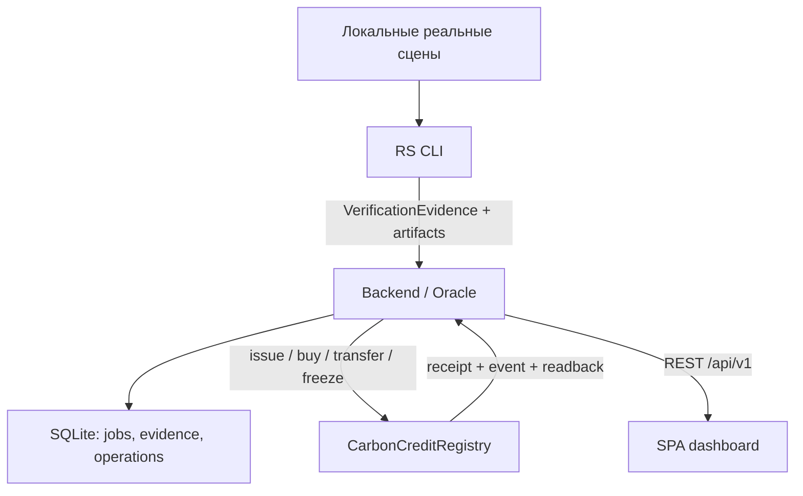
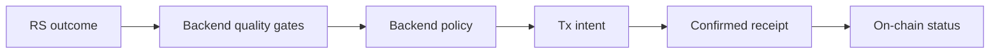

# Архитектура и поток данных

Этот документ — короткая рабочая карта. Полные правила находятся в
`00_BOUNTYTEAM_MANIFEST.md`.



## Главная цепочка P0

1. Backend создаёт `rs-request` для утверждённого проекта и сценария.
2. RS запускается через единый CLI и выдаёт bundle.
3. Backend проверяет schema, геометрию, даты, метрики, пути и SHA-256 файлов.
4. Backend вычисляет JCS/SHA-256 `evidence_hash` и применяет policy v1.
5. При baseline `NO_CHANGE + SUFFICIENT` отдельное demo-разрешение допускает
   выпуск серии. Количество не рассчитывается из NDVI/гектаров.
6. Buyer покупает часть ACTIVE-серии за локальную тестовую валюту.
7. Post-fire evidence даёт `DISTURBANCE_DETECTED`. При выполнении area/quality
   gates и FIRMS support backend создаёт `FREEZE_REQUESTED`.
8. Backend подписывает `freeze`. UI пишет `FROZEN` только после успешного
   receipt, события и readback состояния.
9. Прямая попытка `transfer` замороженной серии отклоняется контрактом.

## Контракты между ролями

| Производитель | Артефакт | Потребитель | Приёмка |
|---|---|---|---|
| Backend/ТЛ | `rs-request.schema.json`, geometry/hash | RS | request валиден, даты и data root доступны |
| RS | `verification.json` + bundle | Backend | schema + `validate_evidence` + file hashes |
| Backend | OpenAPI responses | Frontend | HTTP examples и generated types проходят |
| Blockchain | Реализация согласованного интерфейса, deploy manifest | Backend | ABI diff отсутствует, tests и readback проходят |
| Backend | `issue/buy/transfer/freeze` adapter | Blockchain | сигнатуры/ошибки/nonce/receipt согласованы |
| Backend | `/events`, `/proof`, `/credits` | Frontend/ТЛ | UI не смешивает evidence, decision, tx и credit status |

## Как RS передаёт результат

```bash
python -m rs.verify --request request.json --output bundle_dir
python -m backend.tools.import_bundle --bundle bundle_dir
```

`bundle_dir` содержит `verification.json`, только относительные пути,
`source-index.json`, превью, dNBR GeoTIFF, GeoJSON и использованные локальные
source-assets. Большие источники могут храниться отдельно на двух ноутбуках,
но их SHA-256 и путь внутри передаваемого data root должны разрешаться.

RS никогда не передаёт `FROZEN`, `ACTIVE`, `decision`, `confidence` или
`evidence_hash`. Frontend никогда не читает RS/RPC напрямую. Blockchain не
вычисляет спутниковые индексы.

## Кто принимает решение



`FREEZE_REQUESTED` ещё не `FROZEN`. `SUBMITTED` ещё не `CONFIRMED`. Кнопка,
toast или запись SQLite не заменяет состояние контракта.

## Владение интеграцией

- Integration Owner: Backend.
- Accountable за scope/release: Тимлид.
- ABI и deploy: Blockchain; резерв запуска — Backend.
- Реальный RS run: RS; резерв воспроизведения по инструкции — Backend.
- Demo Operator: Frontend; резерв — Тимлид.

Блокер дольше 20 минут эскалируется. За следующие 10 минут принимается решение:
исправить вместе, переключиться на согласованный fallback или снять P1/P2.
