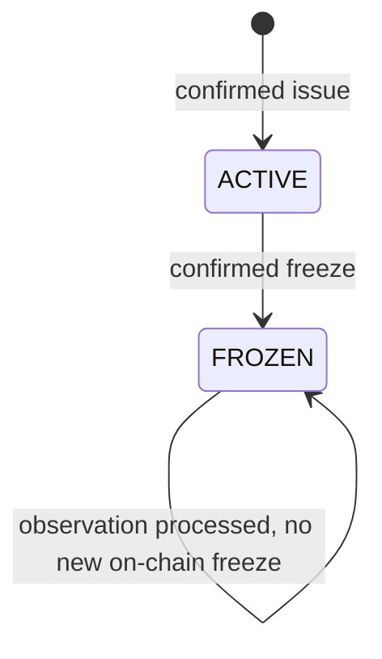
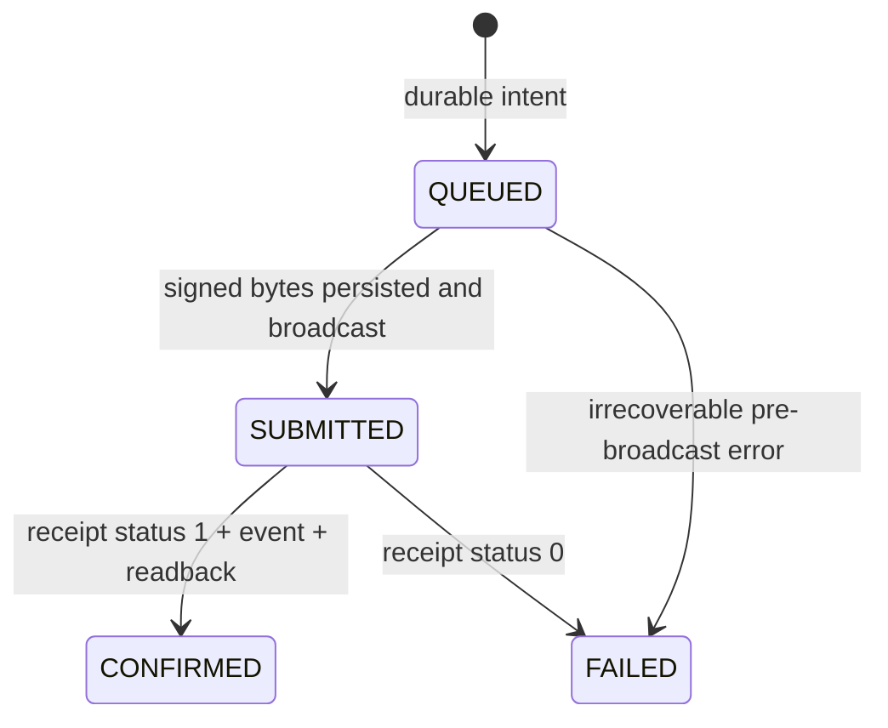

# State machines v1.0.0

## Независимые состояния

| Слой | Enum |
|---|---|
| RS observation | `NO_CHANGE`, `DISTURBANCE_DETECTED`, `INSUFFICIENT_DATA` |
| Evidence quality | `SUFFICIENT`, `REVIEW_REQUIRED`, `INSUFFICIENT` |
| Backend decision | `NO_RESTRICTION`, `REVIEW_REQUIRED`, `FREEZE_REQUESTED` |
| Chain batch | `ACTIVE`, `FROZEN`, `REVOKED` (последний зарезервирован) |
| Job | `QUEUED`, `RUNNING`, `SUCCEEDED`, `FAILED` |
| Transaction | `QUEUED`, `SUBMITTED`, `CONFIRMED`, `FAILED` |

RS не отправляет остальные слои. Backend пересчитывает quality и decision.
Frontend всегда называет слой рядом со значением.

## Policy v1

Порядок правил обязателен:

1. Schema/integrity/cross-field failure → evidence rejected, нет decision/tx.
2. Coverage < 0.70, missing metadata/grid/forest mask → `INSUFFICIENT` +
   `REVIEW_REQUIRED / DATA_INSUFFICIENT`.
3. Coverage 0.70–<0.85 либо temporal comparability не `YES` →
   `REVIEW_REQUIRED / DATA_REVIEW`.
4. `NO_CHANGE + SUFFICIENT` → `NO_RESTRICTION / NO_SIGNIFICANT_CHANGE`.
5. Disturbance ниже 5 га или ниже 1% baseline forest →
   `REVIEW_REQUIRED / BELOW_POLICY_THRESHOLD`.
6. Достаточный disturbance без `SUPPORTED` FIRMS →
   `REVIEW_REQUIRED / DISTURBANCE_UNATTRIBUTED`.
7. Остальной достаточный case → `FREEZE_REQUESTED / FIRE_REVERSAL`.

Все area/coverage gates считаются по integer pixel counts. Порог dNBR 0.27 и
component ≥1 га применяются RS до передачи `affected_pixel_count`.

## Credit lifecycle

Автоматического unfreeze/revoke в P0 нет. `NO_RESTRICTION` от старого/нового
evidence не меняет FROZEN.

`FROZEN → FROZEN` означает сохранение состояния серии при повторной обработке
evidence или новом наблюдении, а не новый on-chain вызов `freeze`.
Backend дедуплицирует evidence и повторные запросы. Новый evidence сохраняется
отдельно, но не создаёт вторую freeze-транзакцию для уже `FROZEN` серии.
On-chain `freeze` разрешён только для существующей `ACTIVE` серии; повторный
вызов для `FROZEN` отклоняется без нового события `Frozen`.
При timeout или pending Backend продолжает reconciliation существующей операции
и не создаёт новую транзакцию с новым nonce. Frontend не приписывает новому
evidence старый on-chain anchor. RS передаёт только наблюдение.

## Transaction lifecycle

Timeout остаётся `SUBMITTED`. Временная недоступность chain оставляет сохранённую
`QUEUED`. Клиент poll-ит operation и не повторяет вслепую.

## Backend operation gates

- Issue: только latest `NO_RESTRICTION`, valid demo authorisation, нет batch и
  pending freeze.
- Buy/transfer through backend: только latest `NO_RESTRICTION`, confirmed
  ACTIVE, нет pending freeze.
- Freeze: только latest `FREEZE_REQUESTED`; выполняется внутренним oracle.
- Contract защищает direct buy/transfer только после confirmed FROZEN. Поэтому
  UI отдельно показывает pending state.
