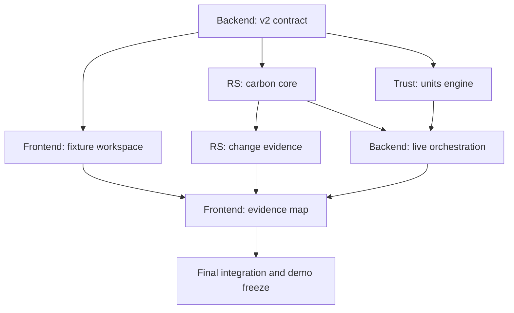

## Обязательное правило источников данных

Единственными авторитетными входными данными для конкурсного расчёта, тестовых эталонов, демонстрационных результатов и итогового отчёта являются:
`data/` — распакованное содержимое предоставленного организаторами архива `data.zip`;
`doc/` — распакованное содержимое предоставленного организаторами архива `doc-1789730244.zip`, включая постановку задачи, критерии, описание данных, формулы и ограничения.

Запрещено:
- подменять выданные растры другими научными наборами;
- брать коэффициенты, baseline, цены, параметры или готовые результаты из сторонних GitHub-репозиториев;
- подключать сторонние предобученные модели без отдельного разрешения Team Lead;
- использовать внешние данные для улучшения конкурсных чисел;
- молча смешивать предоставленные данные с данными другой версии;
- считать GitHub-репозитории источником научной истины.

Указанные в roadmap GitHub-проекты разрешено использовать только как инженерные и архитектурные ориентиры: изучать структуру кода, обработку растров, организацию pipeline, визуализацию, тестирование и reproducibility. Перед заимствованием кода необходимо проверить лицензию и сохранить attribution.

Единственное разрешённое исключение — обязательная демонстрация получения данных из открытого источника по параметрам запроса, требуемая критериями кейса. Для неё разрешено загрузить тот же продукт и совместимую версию, которые описаны в `doc/` и реестре `data/sources.csv`.

Такое получение должно:
- выполняться отдельным adapter/retriever;
- сохранять URL запроса, продукт, версию, дату доступа, лицензию и checksum;
- использовать локальный cache и поддерживать offline replay;
- не подменять предоставленный организаторами набор в основных demo-расчётах;
- сопровождаться сравнением версии и совместимости;
- не изменять эталонные результаты без отдельного решения Team Lead.

Если внешний источник недоступен, основной сервис и демонстрация должны продолжать работать на сохранённых данных из `data/`.

Любое расширение данных, коэффициентов или моделей требует предварительного письменного одобрения Team Lead и отдельного PR с обоснованием влияния на результаты.

# BountyTeam Carbon Lens — Roadmap Team Lead

## Статус и связь с P0

Этот roadmap описывает запланированную разработку Carbon Lens поверх стабильного P0 `p0-integrated-v1.0.0`. Он не утверждает, что функции нового кейса уже реализованы. API v1, frozen contracts, ABI, fixtures и исторические P0-сценарии сохраняются как регрессионный контур. Общий v2-контракт создаётся отдельно в G0 и проходит consumer-review до merge.

Согласованные владельцы: RS отвечает за растры, площади, запасы и evidence; Trust — за итоговую неопределённость, baseline, Q и паспорт; Backend — за v2-контракт, orchestration, хранение и API; Frontend отображает значения API и не вычисляет научные величины. Blockchain — только опциональный этап после готовности обязательного MVP.

## 1. Что мы строим

**Carbon Lens — стресс-тест лесной углеродной инвестиции.**

Сервис отвечает на главный денежный вопрос:

> Сколько потенциальной стоимости проекта действительно остаётся после проверки спутниковыми данными, общей baseline, неопределённостью и резервом?

Наша формула презентации:

> **От инвестиционного вывода — до зоны карты, источника и формулы.**

Мы не обещаем доход и не продаём сертифицированные кредиты. Мы уменьшаем риск вложиться в переоценённый проект.

## 2. Что должно работать в финальном MVP

Пользователь:

1. выбирает готовый участок или задаёт новый допустимый полигон до 20 км²;
2. выбирает период 2019–2024;
3. запускает анализ;
4. видит запас углерода по годам;
5. видит baseline и uncertainty;
6. открывает зоны изменений и evidence;
7. видит, сколько результата исключено;
8. получает `Q` потенциальных единиц и три сценария стоимости;
9. скачивает воспроизводимый отчёт;
10. при недостатке данных получает честную причину, а не выдуманное число.

## 3. Что уже есть и что меняем

### Сохраняем из P0

- FastAPI jobs, polling, idempotency и errors;
- React/Leaflet dashboard, before/after, error boundary;
- RS-паттерны CRS, masks, artifacts, provenance;
- integrity/hash и Blockchain как дополнительный proof;
- тесты и CI.

### Достраиваем для нового кейса

- произвольный polygon + years вместо только `scenario_id`;
- ESA CCI annual biomass и AGB SD;
- carbon timeline 2019–2024;
- SCL cloud/shadow/snow/water quality;
- общую baseline;
- uncertainty interval;
- units waterfall и Q;
- scenario value;
- полноценный report;
- сравнение control/change/subplot.

## 4. Кто за что отвечает

| Роль | Простыми словами | Главный файл |
|---|---|---|
| RS | Достаёт честные числа и зоны из растров | `ROADMAP_RS.md` |
| Backend + Integration | Склеивает запрос, расчёт, хранение, API и отчёт | `ROADMAP_BACKEND.md` |
| Frontend | Делает понятный инвестиционный экран и карту | `ROADMAP_FRONTEND.md` |
| Trust/Units/Blockchain | Считает baseline, вычеты, Q, деньги и provenance | `ROADMAP_TRUST_BLOCKCHAIN.md` |
| Team Lead | Не кодит за всех: держит методику, порядок PR, сроки и защиту | этот файл |

## 5. Твоя работа каждый час

Ты постоянно проверяешь только пять вещей:

1. **Что сейчас строит каждый?** Только текущий этап roadmap.
2. **Какой результат можно показать?** Не «написал 500 строк», а JSON, карта, отчёт, тест.
3. **Кому нужен этот результат дальше?** У каждого PR есть consumer.
4. **Не врём ли мы?** Никаких сертифицированных units, гарантированной прибыли и придуманной причины события.
5. **Не ломаем ли P0?** Старые тесты и tag остаются доказательством стабильности.

## 6. Общая схема зависимости



Люди начинают параллельно. Общий контракт — единственная ранняя точка синхронизации.

## 7. Порядок PR и merge

### Волна 1 — общий язык

1. Backend открывает Draft `feat/lens-g0-contracts`.
2. RS, Frontend и Trust комментируют поля.
3. Team Lead запрещает merge, пока все трое не напишут, что могут потреблять контракт.
4. После зелёного CI и approvals контракт merge первым.

### Волна 2 — параллельное ядро

Параллельно идут:

- RS: `feat/lens-rs-raster-core`;
- Trust: `feat/lens-carbon-engine`;
- Frontend: `feat/lens-frontend-workspace` на fixtures.

Порядок merge:

1. RS carbon core;
2. Trust units engine;
3. Frontend fixture workspace.

Порядок можно поменять, если PR независимы, но каждый должен быть обновлён от актуального `main` и повторно проверить CI.

### Волна 3 — живая интеграция

- RS change evidence;
- Backend analysis flow;
- Trust passport/research; итоговая uncertainty уже принадлежит Trust-1 и не откладывается на эту волну;
- Frontend evidence map.

Рекомендуемый merge:

1. RS evidence;
2. Trust uncertainty;
3. Backend live flow;
4. Trust report;
5. Frontend evidence map.

### Волна 4 — деньги и презентация

- Frontend investor demo;
- Backend final integration;
- Blockchain anchor только если всё обязательное уже готово.

Финальный merge-candidate делает Backend Integration Owner, но **Ready и merge нажимаешь только ты**.

## 8. Правило каждого PR

Разработчик должен:

1. обновить `main`;
2. создать отдельную ветку;
3. сделать один крупный, но проверяемый этап;
4. открыть Draft PR рано;
5. приложить команды и точные результаты;
6. указать ограничения;
7. получить review от потребителя;
8. остановиться.

Ты после этого:

1. проверяешь, что изменены только разрешённые файлы;
2. проверяешь CI;
3. читаешь consumer verdict;
4. обновляешь PR description;
5. переводишь в Ready;
6. делаешь squash merge;
7. ждёшь зелёный `main`;
8. разрешаешь следующий этап.

Никто кроме тебя не merge и не переводит PR в Ready.

## 9. Кто кого проверяет

| Автор PR | Обязательный consumer-review |
|---|---|
| RS carbon/uncertainty input | Trust + Backend |
| RS map/evidence | Frontend + Team Lead по смыслу |
| Backend contract | RS + Trust + Frontend |
| Backend live flow | Frontend |
| Trust units | Backend + RS + Team Lead |
| Trust report | Backend + Frontend |
| Frontend calculation UI | Trust + Backend |
| Frontend evidence map | RS + Backend |
| Final integration | Все четыре владельца |

Автор не может сам поставить себе финальный `APPROVE`.

## 10. Относительный тайминг 28.5 часа

Если оставшееся время отличается, сохраняй доли, а не абсолютные часы.

| Время | Цель | Что должно существовать |
|---|---|---|
| T+0–2 ч | Контракт и ownership | Draft v2 schema, fixtures, ветки |
| T+2–8 ч | Вертикальное ядро | Один реальный AOI от raster до Q JSON |
| T+8–15 ч | Полный обязательный расчёт | 4 AOI + subplot, uncertainty, zones |
| T+15–21 ч | Живой веб-сервис | POST/poll/result/map/waterfall/report |
| T+21–25 ч | Исследование и деньги | sensitivity, scenario value, comparison |
| T+25–27 ч | Clean-clone и rehearsals | frozen code, screenshots, backup demo |
| T+27–28.5 ч | Только защита | никаких новых функций |

### Жёсткая заморозка

За 3–3.5 часа до сдачи запрещены:

- новая архитектура;
- новые зависимости;
- редизайн;
- новый Blockchain;
- изменение формул;
- force-push.

Разрешены только blocker fixes через отдельный PR.

## 11. Четыре demo cases

| Сценарий | Что доказывает |
|---|---|
| `RU_TVER_01` | Сервис не обязан находить нарушение везде; контроль |
| `RU_MORDOVIA_03` | Изменение, fire evidence, вклад зоны в carbon result |
| `CHECK_TRANSFER_01` | Новый подучасток работает без правки кода; baseline переносится на площадь |
| `RU_VOLOGDA_02` или `RU_MORDOVIA_04` | Неоднозначность, причина неизвестна или последующая динамика |

Не пытайся показать все четыре одинаково подробно. Главный live demo: новый подучасток или Mordovia. Остальные — comparison screen/report.

## 12. Как забрать максимум баллов

| Критерий | Что ты обязан потребовать у команды |
|---|---|
| Практическая полезность 10 | Полный путь polygon→report и денежный вывод |
| Анализ 10 | Карта зон, contribution, даты, evidence, честная причина |
| Исследование 10 | Сравнение uncertainty assumptions или mask/threshold sensitivity |
| Презентация 5 | Один цельный live flow, читаемые единицы, backup recording |
| Допфункции 5 | Scenario value + excluded value + integrity proof |
| Data prep 10 | Open retrieval, cache, CRS, scaling, SCL, new polygon |
| Forest change 12 | Пространственные зоны, period, evidence и ambiguity |
| Carbon 10 | Area weighting, correct sign/units, same bounds, no double count |
| Units 8 | Baseline, H/R, UNC, reserve, floor, missing data |
| Uncertainty 10 | Реальный перенос AGB SD + dependence sensitivity |
| Architecture 5 | Чистые модули и versioned contracts |
| Docs 5 | Clean-clone commands, sources, methods, report reproduction |

## 13. Твоя денежная изюминка на защите

Не говорить: «Мы рассчитали кредиты на столько-то рублей».

Говорить:

> Перед инвестором обычно находится одна привлекательная цифра. Carbon Lens раскладывает её на проверяемые части и показывает, какая потенциальная стоимость исчезает после общей baseline, неопределённости, недостаточного покрытия и резерва. Инвестор видит не обещание, а диапазон риска и доказательства до конкретной зоны карты.

Сильный экран — waterfall «до проверки / после проверки». Это заражает идеей денег, но остаётся честным научно.

## 14. Первый чекпоинт — короткий текст

> Мы строим BountyTeam Carbon Lens — веб-сервис для проверки лесных углеродных проектов перед инвестиционным решением. Пользователь задаёт участок и период, а система строит динамику запаса углерода, исключает облака, тени, снег, воду и плохие наблюдения, выделяет зоны изменений и показывает их вклад. Затем мы применяем общую baseline, неопределённость и резерв и считаем не валовой обещанный результат, а консервативный объём потенциальных единиц и его сценарную стоимость. Наша особенность — любой инвестиционный вывод раскрывается до зоны карты, источника и формулы. Существующий P0 даёт нам API, карту, jobs, provenance и integrity; сейчас четыре разработчика параллельно достраивают carbon core, units engine, живой Backend и инвестиционный интерфейс.

## 15. Что спрашивать у каждого разработчика

Вместо «как дела?» спрашивай:

1. Какой этап roadmap ты сейчас закрываешь?
2. Какой один проверяемый artifact уже готов?
3. Какая команда теста зелёная?
4. Что блокирует тебя и кто владелец зависимости?
5. Когда откроешь Draft PR?
6. Кто должен провести consumer-review?
7. Что ты точно не успеваешь и можно вырезать?

## 16. Красные флаги

Останавливай работу, если видишь:

- «сначала всё перепишем»;
- числа в UI без API/source;
- Q при partial coverage;
- «причина — пожар» без evidence;
- GeoTIFF вне проверенного официального `data/` или файлы без provenance/checksum;
- Solidity до units/report;
- OpenCV/ML без A/B-проверки;
- TiTiler/Kubernetes ради названия;
- денежный прогноз без подписи scenario;
- один PR на половину репозитория;
- разработчик сам merge/Ready;
- отсутствие backup cached demo.

## 17. Финальная проверка перед защитой

### Код

- все Actions зелёные;
- clean clone проходит;
- main чистый;
- P0 tag доступен;
- новые source manifests доступны;
- секретов и runtime data нет.

### Наука

- единицы и знак объясняются;
- учитывается только live above-ground biomass;
- uncertainty method не переобещан;
- baseline case-specific;
- Q потенциальные, не сертифицированные;
- scenario prices не прогноз.

### Demo

- live request;
- cached backup;
- screenshots/video;
- report открывается;
- карта и waterfall читаемы;
- один участник знает ответы на methodology, второй — на architecture.

## 18. Когда MVP считается готовым

Не когда «все функции написаны», а когда на чистом `main` ты сам можешь:

1. открыть сайт;
2. задать `CHECK_TRANSFER_01` или новый допустимый контур;
3. выбрать 2020–2024;
4. дождаться результата;
5. объяснить timeline, uncertainty и baseline;
6. кликнуть на зону изменения;
7. показать, сколько потенциальной стоимости исключено;
8. скачать отчёт;
9. повторить сценарий offline из cache;
10. получить те же числа.

## 19. Сообщение всей команде для старта

```text
Начинаем модернизацию стабильного P0 в BountyTeam Carbon Lens. Каждый полностью читает свой ROADMAP_*.md и выполняет только первый этап в отдельной ветке.

Backend первым открывает Draft contract v2. RS, Frontend и Trust параллельно начинают исследование и fixtures, но не меняют shared contract самостоятельно.

Никто не merge, не переводит PR в Ready, не делает force-push и не ломает API v1. В Git уже входит только проверенный официальный набор `data/`; ZIP-дубликаты, runtime-cache и сторонние большие данные не коммитим. Каждый PR обязан содержать проверяемый artifact, точные тесты, ограничения и consumer-review.

Главная цель: показать не максимальную обещанную цифру, а сколько потенциальной стоимости выдерживает baseline, uncertainty и проверку данными.
```
